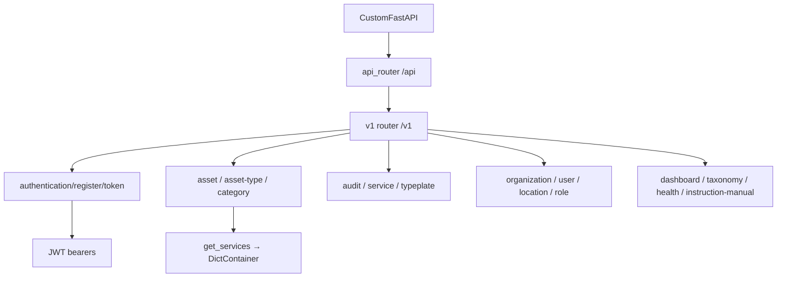
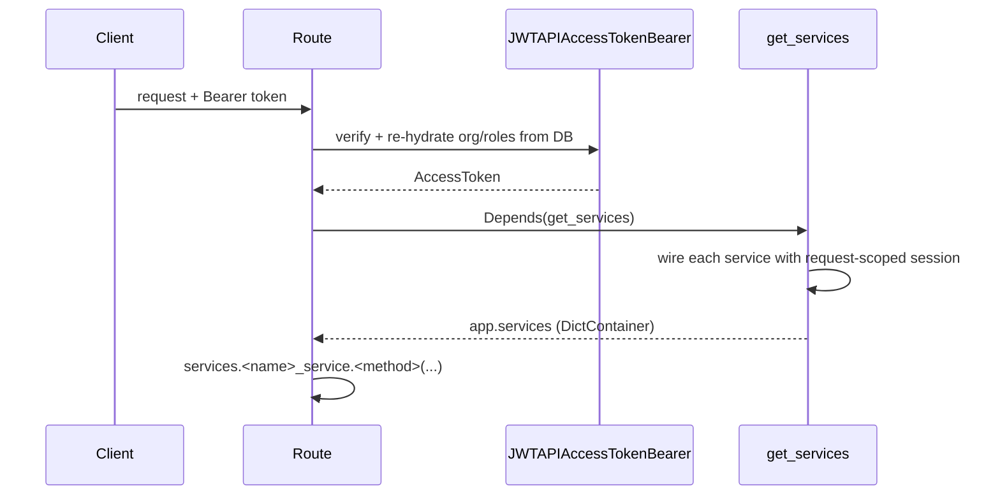
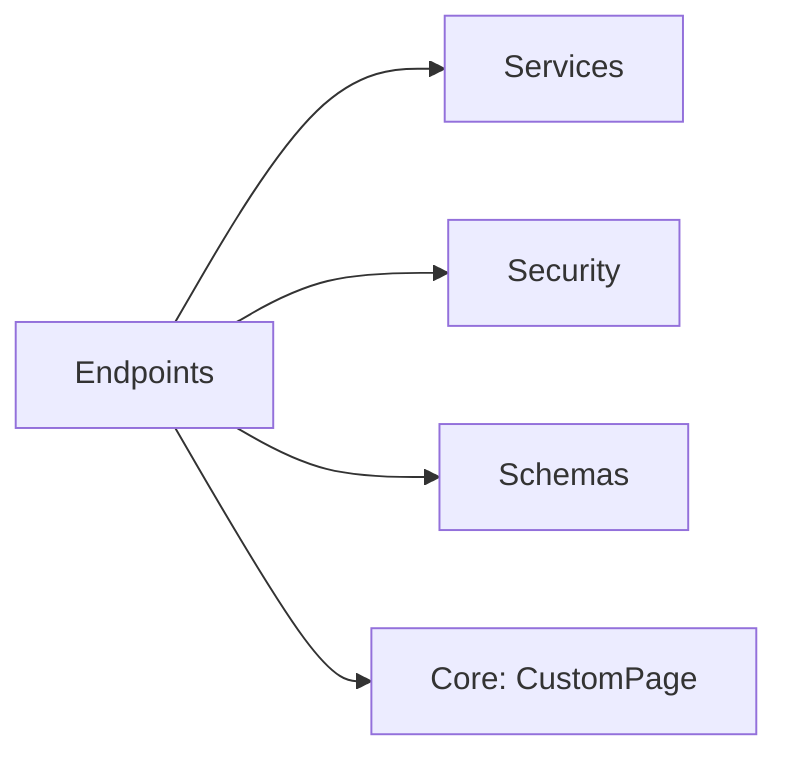

# API Endpoints

## Module Overview

The `endpoints` package exposes the REST API under `/api/v1`. Every domain has a router of fully-spelled-out routes; OpenAPI tags and the `/v1` prefix are applied centrally when sub-routers are included. Routes obtain their dependencies (services, DB session, current token) through FastAPI dependency injection, and list endpoints return the paginated `CustomPage[...]` wrapper.

## Architecture Diagram

## Router Wiring

`endpoints/router.py` builds `api_router` and includes the `v1` rest router; `CustomFastAPI` mounts it under `API_STR` (`/api`). `endpoints/v1/__init__.py` is a parent `APIRouter(prefix="/v1")` that includes each sub-router with a central `tags=[...]`. Each sub-router file declares a bare `router = APIRouter()` with full paths on each decorator and explicit `operation_id`/`status_code`.

## Endpoint Groups

### Authentication (public)

- **`POST /login`** — verifies credentials via `user_service.login`, mints `AccessToken` + `RefreshToken` from `app.clients.token_backend`, returns `UserLoginResponse`.
- **`POST /register`** — `user_service.register_user`, issues an email-verification token via `user_email_token_service`, and auto-logs-in the new user with a token pair (`TokenResponse`).
- **`GET /token/refresh`** — guarded by `JWTAPIRefreshTokenBearer`; returns a fresh access token (`RefreshTokenResponse`). There is no logout endpoint (stateless JWT).

### Assets & passports

- `asset` — create/update/delete, `PUT /asset` (filtered paginated list via `SelectiveFilters` body), `GET /asset/{id}`, `GET /asset-pass` (paginated). **`GET /asset-pass/{passId}` is public** — the digital product passport view.
- `asset-type` — CRUD, filtered list, and document sub-routes (custom-field docs, instruction-manual downloads via streaming); create/update are multipart.
- `asset-type-category` — CRUD, category groups, and filter/mapping endpoints backing dropdowns.

### Operations

- `audit` — create tasks/audits (multipart with document uploads), list (date-range filters), deletes, task-document download, and a localized PDF `audit-report`.
- `service` — CRUD and paginated list of asset service/maintenance records.
- `typeplate` — list images, list/get/update typeplates (multipart EU file), delete document, and EU-file streaming download.
- `instruction-manual` — list/upload/delete instruction-manual documents (backed by `asset_type_service`).

### Organization & users

- `organization` — create org + first location (multipart), update, delete, get details, and org role list/create (which raise `UnAuthorizedError` when the token has no org).
- `user` — profile get/update (multipart avatar), self/other delete, org-user paginated listing (`OrganizationUsersCustomPage`), password change.
- `location` — update current location, list org locations.
- `taxonomy` — list taxonomies.

### Misc

- `dashboard` — `GET /dashboard/summary` returns aggregate counts (`DashboardResponse`).
- `health` — `GET /health` returns version + status; no auth, no service.

## Auth & Dependency Injection

- **Authentication** — `token: AccessToken = Depends(JWTAPIAccessTokenBearer())`. Every protected route instantiates the bearer with **no roles/permissions** (authentication only); per-resource authorization lives in the services or explicit `UnAuthorizedError` raises. The bearer re-hydrates the token's org/location/roles from the DB on each request.
- **Services** — `services: DictContainer = Depends(get_services)`, where `get_services` nests `Depends(get_db_session)` and wires every registered service onto the request-scoped session, accessed as `services.<name>_service`.
- **Public routes** — `/login`, `/register`, `/health`, and `/asset-pass/{passId}`.
- **Conventions** — complex/filtered list endpoints use `PUT` with a body (`SelectiveFilters`) rather than `GET`; pagination params are `page`/`pageSize` (1–1000); file endpoints return `StreamingResponse`; multipart is used for create/update of asset types, typeplates, organizations, user profile, and audits.

> Minor notes carried from the source: the typeplate download path contains a typo (`/typeplate/docuemnt/...`), and `instruction_manual` routes reuse `asset_type_service`.

## Dependencies

## Cross-references

- [Services](services.md) — the business logic each route delegates to
- [Security & Permissions](security-and-permissions.md) — the JWT bearers and token flows
- [Schemas](schemas.md) — request/response models
- [Core Infrastructure](core-infrastructure.md) — `get_db_session`, pagination
- [Application Bootstrap](application-bootstrap.md) — router mounting and `get_services`
