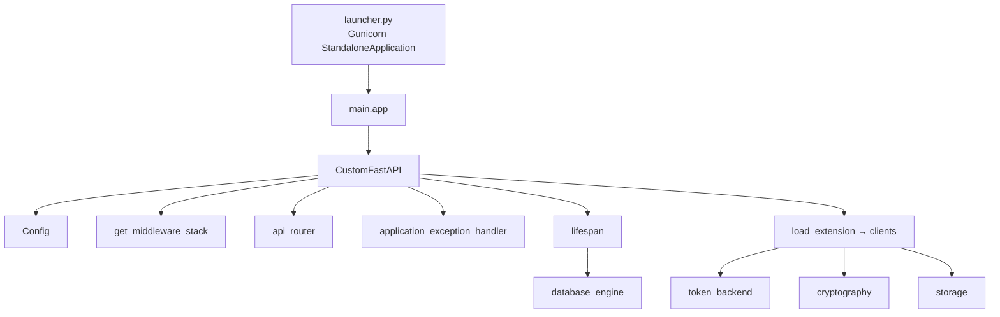
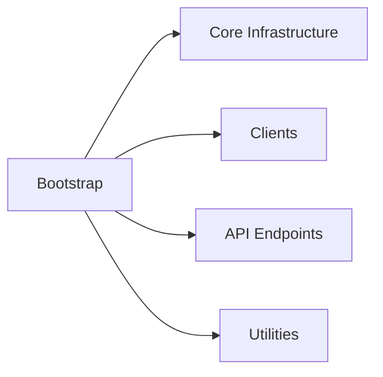

# Application Bootstrap

## Module Overview

This module covers how the Tap2Cloud backend is assembled, configured, and launched. It centers on a custom `FastAPI` subclass that wires middleware, routers, exception handlers, and a plugin-style extension system for clients and services, plus the Gunicorn/Uvicorn launcher that serves the app in production. Downstream projects install this package as a library, subclass `CustomFastAPI`, and build their own app with their own `Config`.

## Architecture Diagram



## Components

### `CustomFastAPI` (`t2c_backend/main.py`)

A `FastAPI` subclass that encapsulates all application setup. Instantiating it builds the fully configured ASGI app; `CustomFastAPI.create()` additionally runs the async `setup_hook()` to load client extensions.

Key responsibilities:

- **Configuration** — reads a `Config` instance (overridable via the `config_class` attribute so subclasses can supply their own settings), and derives `title`, `version` (from `project_meta`), and `debug` (on unless `ENVIRONMENT == PRODUCTION`).
- **Middleware & routers** — installs the middleware stack from `get_middleware_stack()` and includes `api_router` under the configured `API_STR` prefix (default `/api`). `get_api_router()` is a hook subclasses can override to swap the route table.
- **Exception handling** — registers `application_exception_handler` for all `ApplicationError` subclasses.
- **Extension system** — a lightweight plugin loader (`load_extension`, `_load_from_module_spec`, `_call_module_finalizers`). Each extension module exposes a `setup(app)` (and optional `teardown(app)`) coroutine/function. `setup_hook()` loads the `initial_clients`: `token_backend`, `cryptography`, and `storage`.
- **Registries** — `self.clients` (a `DictContainer`) holds singleton clients via `add_client()`; `self.services` (a session-scoped `DictContainer`) holds per-request service instances via `add_service()`.
- **OpenAPI** — `openapi()` post-processes the schema through `_fix_binary()` to correct binary file-upload field types.

Key methods:

| Method | Purpose |
| --- | --- |
| `create()` (classmethod) | Build an instance and run `setup_hook()` — the canonical entry point |
| `setup_hook()` | Load all `initial_clients` extensions, logging failures |
| `load_extension(name, *, package)` | Import a module and call its `setup(app)` |
| `add_client(client, client_name)` | Register a singleton client (rejects duplicates) |
| `add_service(service, session_id)` | Register a per-session service instance |
| `openapi()` | Generate and cache the OpenAPI schema with binary fixups |

The module also defines a lazy `__getattr__` so that importing `t2c_backend.main.app` builds the standalone app on demand (via `asyncio.run(CustomFastAPI.create())`), while importing `CustomFastAPI` itself never builds an app — critical for library consumers.

### `Config` (`t2c_backend/config.py`)

A `pydantic_settings.BaseSettings` model that reads configuration from the environment (case-sensitive, empty values ignored). Notable fields:

- `ENVIRONMENT` (`ENVIRONMENT` enum), `PROJECT_NAME`, `API_STR`
- Database: `DATABASE_HOST`, `DATABASE_PORT` (default 5432), `DATABASE_USER`, `DATABASE_PASSWORD`, `DATABASE_NAME`
- Server: `APP_HOST`, `APP_PORT`, `GUNICORN_WORKERS`, `JSON_LOGS`
- `BACKEND_CORS_ORIGINS` (with an `assemble_cors_origins` validator that accepts a comma-separated string or list), `REQUEST_ID_HEADER_NAME` (default `X-Request-Id`)
- `FRONTEND_URL`

Properties `project_root_path` (also exported to the `PROJECT_ROOT_PATH` env var) and `project_meta` (parsed from `pyproject.toml`) support file storage and version reporting.

### `lifespan` / event handlers (`t2c_backend/core/event_handlers.py`)

An `asynccontextmanager` used as the FastAPI `lifespan`. On startup, `_startup()` constructs the `Engine` and attaches it as `app.database_engine`, using the DB settings from `Config` and enabling SQL echo outside production. `_shutdown()` is currently a no-op.

### `application_exception_handler` (`t2c_backend/core/error_handlers.py`)

Converts any `ApplicationError` into a `JSONResponse` with the error's `status_code` and a body of `{"msg": ..., "errorCode": ...}`. See [Utilities](utilities.md) for the error hierarchy.

### Launcher (`launcher.py`)

Runs the app under Gunicorn with the Uvicorn worker class:

- `StandaloneApplication` — a `gunicorn.app.base.BaseApplication` that binds host/port, sets worker count, and loads the ASGI `app`.
- `setup_logging()` / `InterceptHandler` / `StubbedGunicornLogger` — route stdlib logging, Gunicorn, and Uvicorn logs through **Loguru**, with optional JSON serialization (`JSON_LOGS`) and file rotation at 500 MB.
- `BASE_DIR` — the project root, also consumed by Alembic. Log level is mapped from `ENVIRONMENT`.

## Dependencies



## Key APIs

```python
# Build a fully-initialized app (loads client extensions)
app = await CustomFastAPI.create()

# Library consumers subclass and override config / routes
class MyApp(CustomFastAPI):
    config_class = MyConfig
    def get_api_router(self):
        return my_router
```

## Cross-references

- [Core Infrastructure](core-infrastructure.md) — database engine, sessions, middleware
- [Clients](clients.md) — the extensions loaded at startup
- [API Endpoints](api-endpoints.md) — the router mounted under `API_STR`
- [Utilities](utilities.md) — `Config` enums, `ApplicationError`, `DictContainer`
