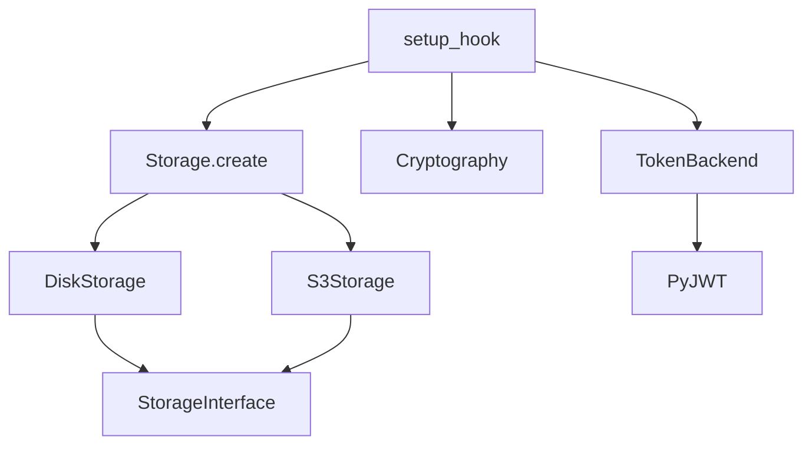
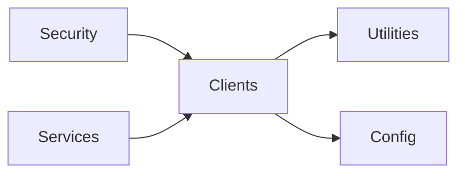

# Clients

## Module Overview

Clients are pluggable, app-scoped singletons loaded at startup through the extension system (each exposes a `setup(app)` that calls `app.add_client(...)`). Three clients ship in the open-source core: **token_backend** (JWT encode/decode), **cryptography** (reversible ID obfuscation), and **storage** (pluggable file storage with a disk and an S3 backend). Once loaded they are reachable as `app.clients.<name>` (e.g. `app.clients.token_backend`).

## Architecture Diagram



## Components

### `TokenBackend` (`clients/token_backend/__init__.py`)

Wraps **PyJWT** for signing and verifying tokens. Validates the algorithm against `ALLOWED_ALGORITHMS` (HS/RS/ES 256/384/512) at construction and confirms `cryptography` is installed for asymmetric algorithms. Supports symmetric keys, static verifying keys, and JWKS URLs (`PyJWKClient`).

Key methods:

| Method | Purpose |
| --- | --- |
| `encode(payload)` | Sign a payload (injecting `aud`/`iss` when configured), returns a JWT string |
| `decode(token, verify=True)` | Validate signature/claims/expiry and return the payload; raises `TokenBackendError` on failure |
| `get_verifying_key(token)` | Resolve the key: signing key for HS*, JWKS/verifying key otherwise |
| `get_leeway()` | Normalize the configured leeway to a `timedelta` |

`DecimalEncoder` serializes `Decimal` claims as int/float. `setup(app)` registers a `TokenBackend` using `HS256` and `Config().SECRET_KEY`. It underpins the [Security & Permissions](security-and-permissions.md) token classes.

### `Cryptography` (`clients/cryptography/__init__.py`)

A small reversible codec using a custom alphabet key (`Config().CRYPTOGRAPHY_KEY`). `encode(string)` treats the UTF-8 bytes as a big integer and renders it in the custom base; `decode(encoded_string)` reverses it. Used to obfuscate identifiers in URLs/payloads. `setup(app)` registers it as a client.

> Note: this is an obfuscation/encoding scheme keyed by a shared alphabet, not authenticated encryption — do not treat encoded values as secret ciphertext.

### Storage (`clients/storage/`)

A strategy-pattern file store selected by configuration.

- **`StorageInterface`** (`interface.py`) — the abstract contract: `save` / `delete` / `get` for raw paths, and `save_document` / `delete_document` / `get_document` that derive paths from `(organization_id, document_for, file_id)` where `document_for` is a `DocumentFor` enum. `get*` methods return async byte-chunk generators for streaming.
- **`Storage.create(app)`** (`__init__.py`) — factory that reads `STORAGE_TYPE` from config and returns a `DiskStorage` or `S3Storage`; `setup(app)` registers the result under the name `"Storage"`.
- **`DiskStorage`** (`disk/__init__.py`) — full implementation over `aiofiles`. Writes under `<project_root>/<BUCKET>/...`, avoids overwrites via `add_unique_postfix` (`name(2).ext`, `name(3).ext`, …), cleans up empty parent directories on delete, and streams reads in configurable chunk sizes.
- **`S3Storage`** (`s3/__init__.py`) — a stub in the open-source core (constructor only); the concrete S3 implementation is part of the proprietary offering.

Configuration (`clients/storage/config.py`): `STORAGE_TYPE` (`"DISK"` | `"S3"`) and `BUCKET`.

## Dependencies



## Key APIs

```python
# Access clients from the app
token = app.clients.token_backend.encode({"user_id": 1})
payload = app.clients.token_backend.decode(token)

obfuscated = app.clients.cryptography.encode("42")

await app.clients.storage.save_document(org_id, DocumentFor.EuFiles, file_id, upload)
async for chunk in app.clients.storage.get_document(org_id, doc_for, file_id, name, 4096):
    ...
```

## Cross-references

- [Application Bootstrap](application-bootstrap.md) — the extension loader and `add_client`
- [Security & Permissions](security-and-permissions.md) — JWT bearers built on `TokenBackend`
- [Services](services.md) — storage consumers (documents, typeplates, audits)
- [Utilities](utilities.md) — the `DocumentFor` enum
