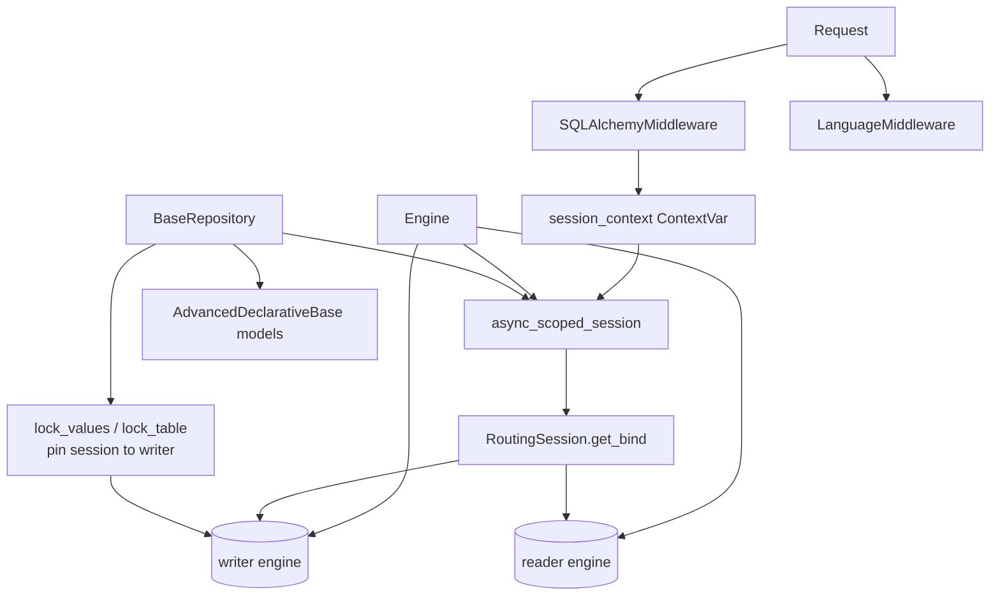
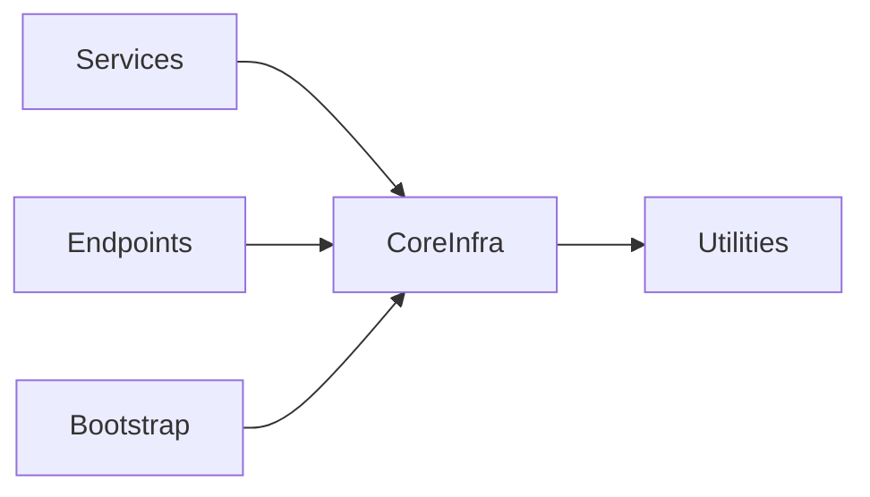

# Core Infrastructure

## Module Overview

The `core` package provides the framework-level plumbing every request relies on: an async SQLAlchemy engine with read/writer routing, a context-scoped session that ties DB sessions to a request ID, a generic filtering/query repository base, custom pagination, request middleware (session lifecycle, i18n), and the internationalization layer. These pieces are consumed by the [services](services.md) and [endpoints](api-endpoints.md) layers rather than used directly by clients.

## Architecture Diagram



## Components

### Database engine (`core/db/engine.py`)

`Engine` builds an async PostgreSQL setup (`postgresql+asyncpg`). It creates **two** async engines keyed `writer` and `reader` (both pointing at the same URL, `pool_recycle=3600`), an `async_sessionmaker` bound to a custom routing session class, and an `async_scoped_session` scoped by the request's session context. `async_session_factory_creator(expire_on_commit=...)` produces sessionmakers for ad-hoc sessions (e.g. token verification outside the request scope).

### Session management (`core/db/session.py`)

- **`session_context`** — a `ContextVar[str]` holding the current request's session id. `get/set/reset_session_context()` manage it.
- **`routing_session_class(engines)`** — returns a `RoutingSession(Session)` whose `get_bind()` sends writes (flush in progress, `info["engine"] == "writer"`, or `Insert`/`Update`/`Delete`/`FOR UPDATE` statements) to the **writer** engine and everything else to the **reader** engine. This is the read/write splitting mechanism.
- **`get_db_session(request)`** — the FastAPI dependency. Opens a session scoped to the `X-Request-Id` header, commits on success, rolls back on `SQLAlchemyError`, and always closes.

### Declarative base & mixins (`core/db/base.py`)

- `AdvancedDeclarativeBase(DeclarativeBase)` — the metadata root for all models (also the Alembic `target_metadata`).
- `BigIntPrimaryKey` — mixin adding a `BigInteger` `id` backed by a per-table `Sequence`.
- `AuditColumns` — `created_at` / `updated_at` timezone-aware timestamps, with a `validates` hook that forces UTC tzinfo.
- `BasicAttributes.to_dict()` — serializes mapped columns to a dict (skipping unloaded/sentinel fields); `CommonTableAttributes` extends it.

### Repository (`core/repository/__init__.py`)

`BaseRepository` is a generic data-access layer parameterized by a model type. Its standout feature is a **Django-style filter parser**: `parse_filters()` turns keyword arguments like `age__gt=18`, `name__ilike="%x%"`, `id__in=[1,2]`, `field__or={...}`, `field__not={...}` into SQLAlchemy `ColumnElement`s via the `_SUPPORTED_FILTERS` operator map (eq/gt/lt/gte/lte/ne/is/like/ilike/startswith/contains/between/in/not_in/or/not, etc.).

Key methods:

| Method | Purpose |
| --- | --- |
| `save` / `save_all` | Add + flush (marks session as writer), optional refresh |
| `get_one_or_none` | Filtered single-row fetch with optional `join`/`options` |
| `list` | Filtered multi-row fetch with `joins`, `options`, `orders` |
| `get` | Primary-key lookup |
| `exists` | `SELECT EXISTS(...)` for filters |
| `lock_values` | Advisory lock on one combination of column values |
| `lock_table` | Whole-table lock in a chosen `TableLockMode` |
| `execute` / `merge` / `delete` | Thin wrappers over the session |

#### Concurrency guards

A "check then write" pair — *does this name already exist? if not, insert it* — is not atomic on its
own. Two concurrent requests can both read "no", both insert, and both commit. A row lock cannot help,
because the row being guarded against does not exist yet. The repository offers two guards for this,
both released by Postgres when the request commits or rolls back:

- **`lock_values(**kwargs)`** — the narrow guard, and the one to prefer. It takes a
  `pg_advisory_xact_lock` keyed by a hash of the table name plus the supplied `column=value` pairs, so
  it only holds up requests competing for the *same* values and leaves every other writer of the table
  running. Values are sorted before hashing, so the key does not depend on keyword order, and every part
  is cast to `text` so `1` and `"1"` cannot collide.
- **`lock_table(mode=TableLockMode.EXCLUSIVE)`** — the blunt guard, for when the whole table genuinely
  has to hold still. `TableLockMode` covers the three Postgres modes worth taking from application code:
  `SHARE` (blocks writers but is shared, so two holders can deadlock the moment they both write),
  `EXCLUSIVE` (blocks writers, self-exclusive, plain `SELECT` unaffected — the default), and
  `ACCESS EXCLUSIVE` (blocks readers too; schema-level work only).

Both methods pin the session to the **writer** engine (`session.info["engine"] = "writer"`) before
issuing the lock. This is load-bearing rather than incidental: reader and writer are separate
connections running separate transactions, so a lock taken on the reader would leave the writer's
`INSERT` blocked on a lock held by its own request, which nothing can release. Because the flag is
sticky for the rest of the session, the subsequent `exists()` check and `save()` run on that same
writer connection and transaction.

Anything the existence check compares *loosely* must be passed as a SQL expression so the lock key
folds the value the same way the check does — `func.lower(name)` alongside a `name__ilike` check.
Folding in Python instead would be wrong: Python and Postgres disagree on some Unicode (Turkish dotted
I, Greek final sigma), which would hand two names the check calls equal two different keys, and the
guard would silently do nothing for exactly those names. The hashing runs in Postgres for the same
reason. Unrelated values can in principle hash to the same key; that costs a little contention, never
correctness.

> A unique index is the cheaper guard where one can be added. These locks are the fallback for cases
> where it cannot — and the only guard that covers a value that does not exist yet.

### Pagination (`core/pagination/__init__.py`)

Built on `fastapi-pagination`. `CustomParams` exposes `page` (≥1) and `page_size` (aliased `pageSize`, 1–1000) and converts to `RawParams` (limit/offset). `CustomPage[T]` is a generic page model adding `page`, `page_size`, and computed `pages`, with a `create()` classmethod that validates from ORM attributes.

### Middleware (`core/middlewares/`)

- **`SQLAlchemyMiddleware`** — pure-ASGI middleware that, for HTTP requests, sets the session context from the request-id header, runs the app, then in `finally` removes the scoped session, evicts the request's services from the session-scoped container, and resets the context var. This is what makes per-request session + service scoping work.
- **`LanguageMiddleware`** — a `BaseHTTPMiddleware` that reads `Accept-Language` and calls `set_locale()` before handling the request.

### Internationalization (`core/i18n/__init__.py`)

`TranslationWrapper` is a singleton wrapping `gettext` translations loaded from the `locales/` directory (default language `en`, fallback enabled). `set_locale(language)` swaps the active translation catalog; `_(message)` is the translation shorthand used across enums and error messages.

## Dependencies



## Key APIs

```python
# Filter parsing in a repository query
users = await repo.list(is_active=True, email__ilike="%@acme.com", id__in=[1, 2, 3])

# Read/write routing is automatic: writes go to the writer engine,
# reads to the reader engine, based on statement type and session.info["engine"].

# Making a read-then-write check atomic. Pass func.lower() (not name.lower())
# so the lock key folds the value exactly as the ilike check does.
await repo.lock_values(name=func.lower(name), product_pass_type_id=product_pass_type.id)
if await repo.exists(name__ilike=escape_like(name), product_pass_type_id=product_pass_type.id):
    raise AlreadyExistsError(msg="Organization with this name already exists.")
await repo.save(Organization(name=name, ...))
```

## Cross-references

- [Data Models](data-models.md) — the ORM models built on `AdvancedDeclarativeBase`
- [Services](services.md) — consumers of `BaseRepository`
- [Application Bootstrap](application-bootstrap.md) — where the engine and middleware are wired
- [Utilities](utilities.md) — the `Language` enum and `DictContainer`
