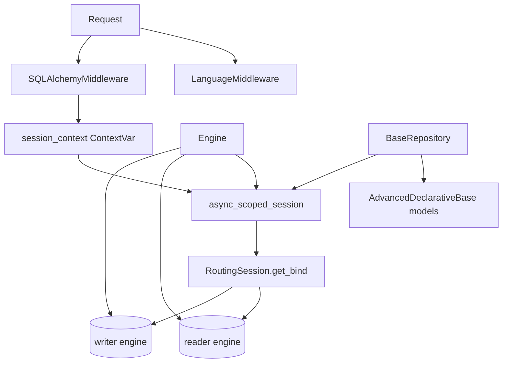
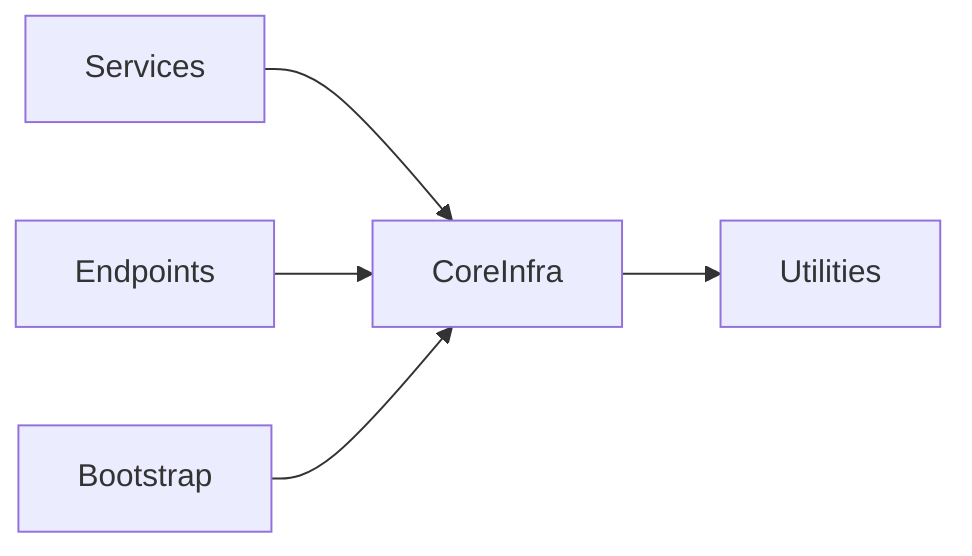

# Core Infrastructure

## Module Overview

The `core` package provides the framework-level plumbing every request relies on: an async SQLAlchemy engine with read/writer routing, a context-scoped session that ties DB sessions to a request ID, a generic filtering/query repository base, custom pagination, request middleware (session lifecycle, i18n), and the internationalization layer. These pieces are consumed by the [services](services.md) and [endpoints](api-endpoints.md) layers rather than used directly by clients.

## Architecture Diagram



## Components

### Database engine (`core/db/engine.py`)

`Engine` builds an async PostgreSQL setup (`postgresql+asyncpg`). It creates **two** async engines keyed `writer` and `reader` (both pointing at the same URL, `pool_recycle=3600`), an `async_sessionmaker` bound to a custom routing session class, and an `async_scoped_session` scoped by the request's session context. `async_session_factory_creator(expire_on_commit=...)` produces sessionmakers for ad-hoc sessions (e.g. token verification outside the request scope).

### Session management (`core/db/session.py`)

- **`session_context`** — a `ContextVar[str]` holding the current request's session id. `get/set/reset_session_context()` manage it.
- **`routing_session_class(engines)`** — returns a `RoutingSession(Session)` whose `get_bind()` sends writes (flush in progress, `info["engine"] == "writer"`, or `Insert`/`Update`/`Delete`/`FOR UPDATE` statements) to the **writer** engine and everything else to the **reader** engine. This is the read/write splitting mechanism.
- **`get_db_session(request)`** — the FastAPI dependency. Opens a session scoped to the `X-Request-Id` header, commits on success, rolls back on `SQLAlchemyError`, and always closes.

### Declarative base & mixins (`core/db/base.py`)

- `AdvancedDeclarativeBase(DeclarativeBase)` — the metadata root for all models (also the Alembic `target_metadata`).
- `BigIntPrimaryKey` — mixin adding a `BigInteger` `id` backed by a per-table `Sequence`.
- `AuditColumns` — `created_at` / `updated_at` timezone-aware timestamps, with a `validates` hook that forces UTC tzinfo.
- `BasicAttributes.to_dict()` — serializes mapped columns to a dict (skipping unloaded/sentinel fields); `CommonTableAttributes` extends it.

### Repository (`core/repository/__init__.py`)

`BaseRepository` is a generic data-access layer parameterized by a model type. Its standout feature is a **Django-style filter parser**: `parse_filters()` turns keyword arguments like `age__gt=18`, `name__ilike="%x%"`, `id__in=[1,2]`, `field__or={...}`, `field__not={...}` into SQLAlchemy `ColumnElement`s via the `_SUPPORTED_FILTERS` operator map (eq/gt/lt/gte/lte/ne/is/like/ilike/startswith/contains/between/in/not_in/or/not, etc.).

Key methods:

| Method | Purpose |
| --- | --- |
| `save` / `save_all` | Add + flush (marks session as writer), optional refresh |
| `get_one_or_none` | Filtered single-row fetch with optional `join`/`options` |
| `list` | Filtered multi-row fetch with `joins`, `options`, `orders` |
| `get` | Primary-key lookup |
| `exists` | `SELECT EXISTS(...)` for filters |
| `execute` / `merge` / `delete` | Thin wrappers over the session |

### Pagination (`core/pagination/__init__.py`)

Built on `fastapi-pagination`. `CustomParams` exposes `page` (≥1) and `page_size` (aliased `pageSize`, 1–1000) and converts to `RawParams` (limit/offset). `CustomPage[T]` is a generic page model adding `page`, `page_size`, and computed `pages`, with a `create()` classmethod that validates from ORM attributes.

### Middleware (`core/middlewares/`)

- **`SQLAlchemyMiddleware`** — pure-ASGI middleware that, for HTTP requests, sets the session context from the request-id header, runs the app, then in `finally` removes the scoped session, evicts the request's services from the session-scoped container, and resets the context var. This is what makes per-request session + service scoping work.
- **`LanguageMiddleware`** — a `BaseHTTPMiddleware` that reads `Accept-Language` and calls `set_locale()` before handling the request.

### Internationalization (`core/i18n/__init__.py`)

`TranslationWrapper` is a singleton wrapping `gettext` translations loaded from the `locales/` directory (default language `en`, fallback enabled). `set_locale(language)` swaps the active translation catalog; `_(message)` is the translation shorthand used across enums and error messages.

## Dependencies



## Key APIs

```python
# Filter parsing in a repository query
users = await repo.list(is_active=True, email__ilike="%@acme.com", id__in=[1, 2, 3])

# Read/write routing is automatic: writes go to the writer engine,
# reads to the reader engine, based on statement type and session.info["engine"].
```

## Cross-references

- [Data Models](data-models.md) — the ORM models built on `AdvancedDeclarativeBase`
- [Services](services.md) — consumers of `BaseRepository`
- [Application Bootstrap](application-bootstrap.md) — where the engine and middleware are wired
- [Utilities](utilities.md) — the `Language` enum and `DictContainer`
