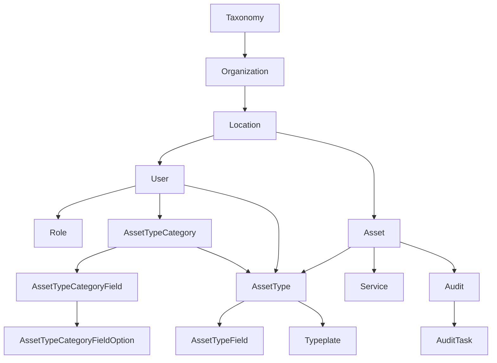
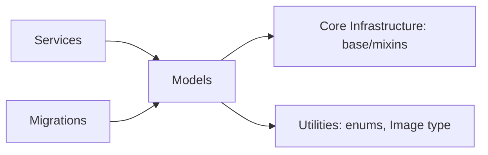

# Data Models

## Module Overview

The `models` package defines the SQLAlchemy ORM entities backing the Digital Product Passport domain. The schema cleanly separates a **definition layer** (categories, fields, asset types, typeplates) from a **runtime/instance layer** (assets, services, audits), threaded together by **tenancy** (Organization → Location → User). All models build on `AdvancedDeclarativeBase` and mix in `BigIntPrimaryKey`, `AuditColumns`, and `CommonTableAttributes` from [Core Infrastructure](core-infrastructure.md); document tables typically use UUID primary keys instead.

## Entity-Relationship Diagram



## Component Descriptions

### Tenancy & people

- **`Organization`** (`organizations`) — the top-level tenant, classified by a `Taxonomy`, owning many `Location`s. Exposes dynamically-attached computed counts (`add_location_count`, `add_user_count`, `add_role_count`) as column properties. Has a `logo` (`ImageType`).
- **`Taxonomy`** (`taxonomies`) — classification/type used to categorize organizations (`name`, `display_name`).
- **`Location`** (`locations`) — a physical site of an organization; hosts users and assets; carries address/contact fields.
- **`User`** (`users`) — an authenticated person tied to a `Location`, with `hashed_password`/`salt`, unique `email`, verification flags, `profile_avatar`, helpers `get_full_name()`/`get_short_name()`, `email_tokens`, and a many-to-many link to `Role`.
- **`Role`** (`roles`) — org-scoped permission set; `permissions` is a numeric bitmask (see [Security & Permissions](security-and-permissions.md)). Linked to users via `user_roles` and to invitees via `user_invite_roles`.
- **`UserRole`** (`user_roles`) — user↔role association table.
- **`UserEmailToken`** (`user_email_verification`) — email verification / password token (`user_token`, `type` = `TokenType`, `is_used`).
- **`UserInvite`** / **`UserInviteRole`** — pending invitations with assigned roles (defined in `user.py`; referenced by `Role` relationships though not re-exported by `models/__init__.py`).

### Asset definition (schema) layer

- **`AssetTypeCategory`** (`asset_type_categories`) — a user-owned template defining the schema for asset types; has `has_typeplates`, ordered `fields`.
- **`AssetTypeCategoryGroup`** (`asset_type_category_group`) — logical grouping/section for organizing category fields (`name`, `order`).
- **`AssetTypeCategoryField`** (`asset_type_category_fields`) — a field definition within a category (`field_type` = `InputType`, name/placeholder/display/required/order), with `options`.
- **`AssetTypeCategoryFieldOption`** (`asset_type_category_field_options`) — a selectable option (`option_id`, `option_label`) for a category field.
- **`AssetType`** (`asset_types`) — a user-owned model/template belonging to a category; carries media links, `weight`, `manufacturer`, instantiates the category's schema as concrete `fields`, and optionally owns one `Typeplate` plus `documents`.
- **`AssetTypeField`** / **`AssetTypeFieldOptions`** — concrete field values (and selected options) on an asset type, instantiated from the category definitions.
- **`Typeplate`** (`typeplates`) — one-to-one compliance nameplate for an asset type (`test_results`, `eu_id`, `carbon_footprint_label`), with `documents` and image mappings.
- **`TypeplateDocument`** / **`TypeplateImage`** / **`TypelateImageMapping`** — typeplate document files, shared images, and the typeplate↔image association table.

### Asset instance / operational layer

- **`Asset`** (`assets`) — the operational core: references an `AssetType` (definition) and a `Location` (placement), carries `pass_id` (the digital-passport identifier), `device_id`, `status` (`AssetStatus`), `serial_no`, `economic_operator`. Unique on `(device_id, location_id)`. Aggregates `services` and `audit`.
- **`Service`** (`services`) — a maintenance/service record on an asset (`service_type` = `ServiceTypes`, provider, `expire_date`, `service_date`).
- **`Audit`** (`audits`) — an inspection event on an asset by a user (`inspection_date`, `valid_until`), decomposed into `audit_tasks`.
- **`AuditTask`** (`audit_tasks`) — a step within an audit (`task_type` = `TaskType`, `status` = `AuditTaskStatus`, performer info), with `documents`.
- **`AuditTaskDocument`** (`audit_task_documents`) — a file attached to an audit task (UUID PK).

### Document satellites

Files are modeled per-owner rather than centrally: **`Document`** (location-scoped general docs, UUID PK, `type`/`status` enums), **`AssetTypeDocument`**, **`TypeplateDocument`**, and **`AuditTaskDocument`**. Most use UUID primary keys and `AuditColumns`.

## Dependencies



## Key APIs

```python
# Filtering flows through BaseRepository (see Core Infrastructure):
await asset_repo.get_one_or_none(device_id="X", location_id=1)

# Computed counts are attached dynamically before querying an organization:
add_location_count(); add_user_count(); add_role_count()
```

## Cross-references

- [Core Infrastructure](core-infrastructure.md) — `AdvancedDeclarativeBase`, `BigIntPrimaryKey`, `AuditColumns`, repository
- [Schemas](schemas.md) — the Pydantic DTOs that mirror these models
- [Services](services.md) — the business logic operating on these models
- [Database Migrations](database-migrations.md) — how the schema is created/seeded
- [Utilities](utilities.md) — the enums used as column types
