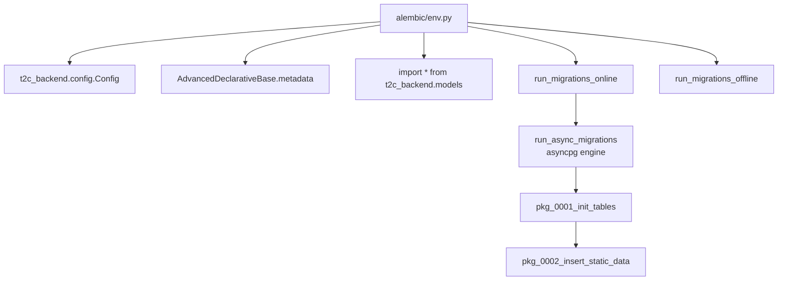
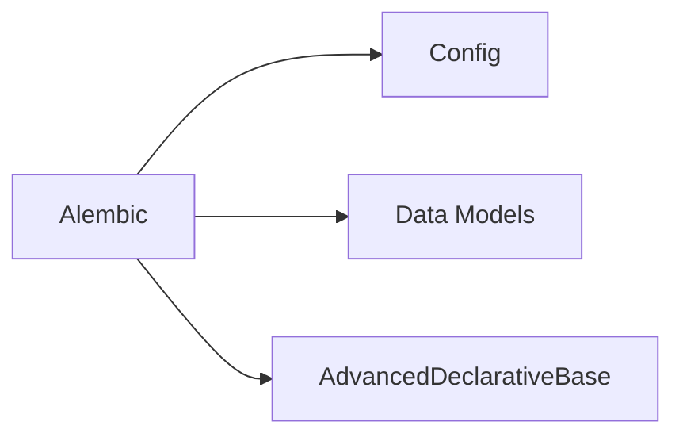

# Database Migrations

## Module Overview

The `alembic/` directory holds the database migration environment and versioned schema migrations. It runs against PostgreSQL over async (`asyncpg`), reusing the application's `Config` and the `AdvancedDeclarativeBase` metadata so autogeneration stays in sync with the ORM models.

## Architecture Diagram



## Components

### Migration environment (`alembic/env.py`)

- Builds an `app_config = Config(project_root=BASE_DIR)` (from the launcher's `BASE_DIR`) and imports all models via `from t2c_backend.models import *` so that `AdvancedDeclarativeBase.metadata` is fully populated — this is the `target_metadata` used for autogenerate.
- **Offline mode** (`run_migrations_offline`) — configures Alembic with a URL only and emits SQL without a DBAPI connection.
- **Online mode** (`run_migrations_online` → `run_async_migrations`) — constructs the `postgresql+asyncpg` URL from the DB settings in `Config`, creates an async engine with a `NullPool`, and runs `do_run_migrations` inside `connection.run_sync(...)`.

### Versioned migrations (`alembic/versions/`)

- **`pkg_0001_init_tables`** — `upgrade()` / `downgrade()` create/drop the full initial schema (organizations, locations, users, roles and association tables, asset types/categories/fields/options, assets, services, audits and tasks, typeplates, documents, taxonomies, email tokens, invites).
- **`pkg_0002_insert_static_data`** — `upgrade()` / `downgrade()` seed/remove static reference data (e.g. taxonomies and category groups).

## Dependencies



## Key APIs

```bash
alembic upgrade head          # apply all migrations
alembic revision --autogenerate -m "message"   # generate from model changes
alembic downgrade -1          # roll back one revision
```

## Cross-references

- [Data Models](data-models.md) — the ORM models whose metadata drives autogenerate
- [Core Infrastructure](core-infrastructure.md) — `AdvancedDeclarativeBase` and the async engine
- [Application Bootstrap](application-bootstrap.md) — `Config` and `BASE_DIR`
