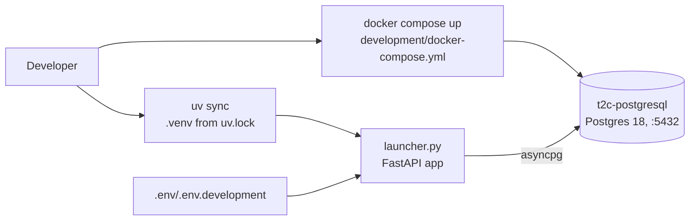

# Development Setup

This module documents how to run Tap2Cloud locally for development: managing the Python environment with **[uv](https://docs.astral.sh/uv/)**, and standing up a throwaway **PostgreSQL** database with the provided `development/docker-compose.yml` — so you can run the project without provisioning an external database.

## Overview

Local development relies on two things the repository ships out of the box:

1. **`uv`** for the Python toolchain — it reads `.python-version`, creates the `.venv`, and installs the exact dependency set pinned in `uv.lock`.
2. **`development/docker-compose.yml`** — a single-service Postgres 18 container whose defaults line up with the sample environment file, giving you a ready-to-use database with one command.



## Prerequisites

- **Python 3.12** — the version pinned in `.python-version`. `uv` will fetch it automatically if it is not already installed.
- **uv** — install per the [official guide](https://docs.astral.sh/uv/getting-started/installation/) (e.g. `curl -LsSf https://astral.sh/uv/install.sh | sh`).
- **Docker + Docker Compose** — only needed for the local database described below.

## Python Environment with uv

The project is a standard uv-managed project. Dependencies (and their dev/test groups) are declared in `pyproject.toml` and locked in `uv.lock`.

```bash
# Install main dependencies into a fresh .venv (uses .python-version + uv.lock)
uv sync

# Include the dev and test tooling (ruff, pytest, faker, ...)
uv sync --all-groups
```

Relevant `pyproject.toml` groups:

```toml
[dependency-groups]
dev = [
    "ruff>=0.16.4",
]
test = [
    "faker>=40.37.0",
    "pillow>=12.3.0",
    "pytest>=9.1.1",
    "pytest-mock>=3.15.1",
    "pytest-order>=1.5.0",
]
```

Once synced, run commands inside the environment with `uv run` (no manual activation needed):

```bash
uv run ruff check .          # lint
uv run pytest                # tests
uv run python launcher.py    # start the app
```

> `uv sync` keeps `.venv` exactly in step with `uv.lock`. Add a dependency with `uv add <pkg>` (or `uv add --group dev <pkg>`), which updates both `pyproject.toml` and the lockfile.

## Local Database with Docker Compose

`development/docker-compose.yml` defines one service, `t2c-postgresql`, so you don't have to install or configure Postgres on your host — ideal for spinning the project up in a development environment without an external database.

```yaml
services:
  t2c-postgresql:
    image: postgres:18.4-alpine
    container_name: t2c-postgresql
    hostname: t2c-postgresql
    ports:
      - "5432:5432"
    environment:
      - POSTGRES_USER=${DATABASE_USER:-t2c_user}
      - POSTGRES_PASSWORD=${DATABASE_PASSWORD:-root}
      - POSTGRES_DB=${DATABASE_NAME:-t2c_master}
    volumes:
      - t2c_postgresql_data:/var/lib/postgresql
```

Key points:

- **Defaults match the sample env** — user `t2c_user`, password `root`, database `t2c_master`, port `5432`. These mirror `.env/.env.development`, so no extra wiring is required.
- **Overridable** — the credentials read from `DATABASE_USER` / `DATABASE_PASSWORD` / `DATABASE_NAME` in your shell (or a compose `.env`) if you want non-default values.
- **Persistent** — data survives restarts via the named volume `t2c_postgresql_data`.
- **Isolated network** — runs on a dedicated bridge network (`172.16.112.0/24`).

Start the database:

```bash
docker compose -f development/docker-compose.yml up -d
```

Stop it (keeping data):

```bash
docker compose -f development/docker-compose.yml down
```

Stop and wipe the data volume for a clean slate:

```bash
docker compose -f development/docker-compose.yml down -v
```

## Putting It Together

The application reads its configuration from the process environment via `pydantic-settings` (see [Application Bootstrap](application-bootstrap.md)). The repository ships `.env/.env.development` with values that already point at the Docker database (`DATABASE_HOST=localhost`, user/password/name as above). Supply them to the process — the idiomatic uv way is `--env-file`:

```bash
# 1. Environment + dependencies
uv sync --all-groups

# 2. Start the local Postgres
docker compose -f development/docker-compose.yml up -d

# 3. Create the schema and seed static data (see Database Migrations)
uv run --env-file .env/.env.development alembic upgrade head

# 4. Run the app
uv run --env-file .env/.env.development python launcher.py
```

FastAPI then serves the OpenAPI docs under the app's `/api` prefix.

## Cross-references

- [Application Bootstrap](application-bootstrap.md) — how `Config` and the launcher assemble the app
- [Database Migrations](database-migrations.md) — Alembic environment and `alembic upgrade head`
- [Core Infrastructure](core-infrastructure.md) — the async engine and session handling that connect to this database
- [Repository Overview](overview.md) — top-level architecture and technology stack
