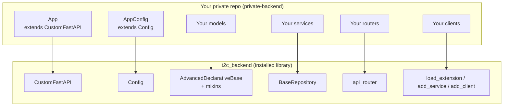

# Extending Tap2Cloud — Using the Public Core as a Library

This repository (`backend-public`) is the **open-source core** of Tap2Cloud. It is not only a runnable
application — it is packaged as a reusable Python library (`tap2cloud-backend-opensource`, imported as
`t2c_backend`) that you install into your **own private repository** to:

1. **Use the basic functionality** — assets, asset types, product pass types, audits, auth, etc. — as-is, and
2. **Extend it** — add your own models, schemas, services, clients, and endpoints on top of the core
   without forking or modifying this repository.

This is exactly how the private Tap2Cloud deployment is built: it depends on this package and layers
proprietary modules (advanced organizational management, enterprise identity, the concrete S3 storage
backend, compliance automation) on top. This document explains the mechanism and walks through a full,
concrete example.

> This guide assumes you have read [Application Bootstrap](application-bootstrap.md),
> [Core Infrastructure](core-infrastructure.md), and [Services](services.md). It documents the
> extension points those modules were deliberately designed to expose.

---

## Why this repo is extension-friendly

The core was written so that **nothing forces an app to exist at import time**, and every layer has a
seam you can hook into:

| Extension point | Mechanism | Where it lives |
| --- | --- | --- |
| App assembly | Subclass `CustomFastAPI` | `t2c_backend/main.py` |
| Configuration | Subclass `Config`, set `config_class` | `t2c_backend/config.py` |
| Route table | Override `get_api_router()` | `t2c_backend/main.py` |
| Data models | Inherit the shared declarative base + mixins | `t2c_backend/core/db/base.py` |
| DB access | Reuse `BaseRepository` | `t2c_backend/core/repository` |
| Schemas | Plain Pydantic models with `from_attributes` | `t2c_backend/schemas/v1` |
| Business logic | Service class + `setup()` + `add_service()` | `t2c_backend/services` |
| Startup clients | Module with `setup`/`teardown` + `load_extension()` | `t2c_backend/main.py` |

The single most important design decision is in `t2c_backend/main.py`:

```python
def __getattr__(name):
    # Build the standalone app lazily, only when `app` is explicitly imported.
    # Importing CustomFastAPI or any other name must NOT build an app: downstream
    # projects install this package as a library, subclass CustomFastAPI, and build
    # their own app with their own Config.
    if name == "app":
        app = asyncio.run(CustomFastAPI.create())
        ...
```

Because the module-level `app` is built lazily, `from t2c_backend.main import CustomFastAPI` never
constructs an application using the core's own `Config`. Your downstream project brings its own `Config`
and its own route table.



---

## Step 0 — Install the core as a dependency

In your private repository's `pyproject.toml`, depend on this package. Point it at the Git repo (or a
private index / built wheel):

```toml
[project]
name = "private-backend"
requires-python = ">=3.12"
dependencies = [
    "tap2cloud-backend-opensource @ git+https://github.com/Tap2Cloud/backend-public.git@main",
    # ...your own dependencies
]
```

Or with `uv`:

```bash
uv add "git+https://github.com/Tap2Cloud/backend-public.git@main"
```

Once installed, `import t2c_backend` works from site-packages. Note that `Config.project_meta` reads the
**installed** package's metadata, which is why your downstream app must supply its own `config_class`
(see Step 2) rather than relying on the core building an app for you.

A typical private repo layout mirrors the core so the pieces line up naturally:

```
private-backend/
├── pyproject.toml
├── launcher.py                 # your entrypoint (see Step 8)
├── alembic/                    # your migrations (see Step 5)
│   └── env.py
└── private_backend/
    ├── config.py               # AppConfig(Config)
    ├── main.py                 # App(CustomFastAPI)
    ├── models/                 # your ORM models
    ├── schemas/                # your Pydantic DTOs
    ├── services/               # your services
    ├── endpoints/              # your routers
    └── clients/                # your startup clients
```

The rest of this guide builds one concrete feature end-to-end: **asset warranties** — a new
`WarrantyClaim` entity linked to the core `Asset` model, with its own schema, service, and REST
endpoints, plus a custom startup client.

---

## Step 1 — Extend the configuration

Subclass the core `Config` and add whatever settings your extensions need. `Config` is a
`pydantic-settings` `BaseSettings`, so new fields are populated from environment variables.

```python
# private_backend/config.py
from t2c_backend.config import Config


class AppConfig(Config):
    # Your extra, environment-driven settings:
    WARRANTY_PROVIDER_URL: str
    WARRANTY_API_KEY: str
    DEFAULT_WARRANTY_MONTHS: int = 24
```

You inherit every core setting (`DATABASE_*`, `APP_HOST`, `ENVIRONMENT`, `PROJECT_NAME`,
`API_STR`, `BACKEND_CORS_ORIGINS`, …) automatically.

---

## Step 2 — Subclass `CustomFastAPI`

Bind your config and your route table to the app by overriding the two seams the core exposes:
`config_class` (a class attribute) and `get_api_router()` (a method).

```python
# private_backend/main.py
import asyncio

from fastapi import APIRouter

from t2c_backend.main import CustomFastAPI
from t2c_backend.endpoints.router import api_router as core_api_router

from private_backend.config import AppConfig
from private_backend.endpoints.warranty import router as warranty_router

# Your extra startup clients, loaded the same way the core loads its own.
extra_clients = [
    "private_backend.clients.warranty_provider",
]


class App(CustomFastAPI):
    # 1) Use your Config subclass instead of the core one.
    config_class = AppConfig

    # 2) Compose the route table: keep the core routes, add your own.
    def get_api_router(self) -> APIRouter:
        router = APIRouter()
        router.include_router(core_api_router)  # everything the OSS core ships
        router.include_router(warranty_router)  # your new endpoints
        return router

    # 3) Load your startup clients in addition to the core clients.
    async def setup_hook(self) -> None:
        await super().setup_hook()  # loads token_backend, cryptography, storage
        for extension in extra_clients:
            await self.load_extension(extension)


def __getattr__(name):
    # Same lazy-build trick as the core, so importing App never builds an app.
    if name == "app":
        app = asyncio.run(App.create())
        globals()["app"] = app
        return app
    raise AttributeError(f"module {__name__!r} has no attribute {name!r}")
```

Key points:

- **`get_api_router()`** — the core includes whatever this returns under `config.API_STR` (`/api` by
  default). Return `core_api_router` alone to expose only the core routes; compose it with your routers
  to add features; return only your own router to fully replace the route table.
- **`config_class`** — used in `CustomFastAPI.__init__` to build `self.config` and to derive the app
  title/version. Your subclass' `AppConfig` is instantiated for you.
- **`create()` / `setup_hook()`** — `CustomFastAPI.create()` (an async classmethod) constructs the
  instance and then awaits `setup_hook()`, which is where startup clients are loaded. Override it and
  call `super().setup_hook()` first so the core clients still load.

---

## Step 3 — Add a new model

Your models inherit the **same** declarative base and mixins the core uses. Because they all register on
`AdvancedDeclarativeBase.metadata`, Alembic autogenerate (Step 5) discovers them automatically, and you
can create real foreign keys and relationships to core tables like `assets`.

```python
# private_backend/models/warranty.py
from datetime import UTC, datetime

from sqlalchemy import DateTime, ForeignKey, Text
from sqlalchemy.orm import Mapped, mapped_column, relationship

from t2c_backend.core.db import (
    AdvancedDeclarativeBase,
    AuditColumns,
    BigIntPrimaryKey,
    CommonTableAttributes,
)


class WarrantyClaim(BigIntPrimaryKey, CommonTableAttributes, AdvancedDeclarativeBase, AuditColumns):
    __tablename__ = "warranty_claims"

    reference: Mapped[str] = mapped_column(Text(), nullable=False)
    description: Mapped[str] = mapped_column(Text(), nullable=True)
    resolved_at: Mapped[datetime] = mapped_column(DateTime(timezone=True), nullable=True)

    # Foreign key straight into the core `assets` table.
    asset_id: Mapped[int] = mapped_column(ForeignKey("assets.id", ondelete="CASCADE"))
    asset = relationship("Asset")
```

The mixins give you, for free:

- `BigIntPrimaryKey` → a `BigInteger` `id` primary key backed by a sequence.
- `AuditColumns` → timezone-aware `created_at` / `updated_at` with automatic `onupdate`.
- `CommonTableAttributes` → `to_dict()` serialization helper.
- `AdvancedDeclarativeBase` → shared metadata (the reason Alembic sees your tables).

> **Do not** re-declare or modify core tables. Reference them by their `__tablename__`
> (`"assets.id"`) or import the core model class (`from t2c_backend.models import Asset`) and use
> `relationship("Asset")`. This keeps you cleanly on the extension side of the open-core boundary.

Collect your models in a package `__init__.py` (mirroring `t2c_backend/models/__init__.py`) so a single
import registers them all with the metadata:

```python
# private_backend/models/__init__.py
from .warranty import WarrantyClaim

__all__ = ["WarrantyClaim"]
```

---

## Step 4 — Add a schema

Schemas are plain Pydantic models. Follow the core conventions: `ConfigDict(from_attributes=True)`,
camelCase wire aliases via `Field(..., alias=...)`, and static `convert` / `from_model` / `to_orm`
helpers to map between ORM objects and DTOs.

```python
# private_backend/schemas/warranty.py
from pydantic import BaseModel, ConfigDict, Field

from private_backend.models import WarrantyClaim as WarrantyClaimModel


class CreateWarrantyClaim(BaseModel):
    asset_id: int = Field(..., alias="assetId")
    reference: str
    description: str | None = None

    model_config = ConfigDict(from_attributes=True)


class WarrantyClaimResponse(BaseModel):
    id: int
    asset_id: int = Field(..., alias="assetId")
    reference: str
    description: str | None = None

    model_config = ConfigDict(from_attributes=True)

    @staticmethod
    def convert(claim: WarrantyClaimModel) -> "WarrantyClaimResponse":
        return WarrantyClaimResponse(
            id=claim.id,
            assetId=claim.asset_id,
            reference=claim.reference,
            description=claim.description,
        )
```

---

## Step 5 — Wire up migrations for your models

Your private repo runs its **own** Alembic environment. The only trick is that `env.py` must import
both the core models and your models so that everything is present on
`AdvancedDeclarativeBase.metadata` before autogenerate runs.

```python
# alembic/env.py  (private repo — abbreviated; model it on the core's env.py)
from t2c_backend.core.db import AdvancedDeclarativeBase
from t2c_backend.models import *  # noqa: F403  -> registers the core tables
from private_backend.models import *  # noqa: F403  -> registers YOUR tables

target_metadata = [AdvancedDeclarativeBase.metadata]
```

Because the core and your models share one metadata object, a single `target_metadata` covers both.
Then, as usual:

```bash
alembic revision --autogenerate -m "add warranty_claims"
alembic upgrade head
```

> Autogenerate will only "see" a table if its module has been imported. The wildcard imports above (and
> your `models/__init__.py` from Step 3) are what guarantee that.

---

## Step 6 — Add a service

A service owns the business logic for one domain. Copy the core pattern exactly:

- A class with a `_model` attribute and `__init__(self, app, session)` that builds a `BaseRepository`.
- A module-level `setup(app, session, *args, **kwargs)` that registers the instance via
  `app.add_service(...)`, keyed by the request's session id.

```python
# private_backend/services/warranty.py
from t2c_backend.core.repository import BaseRepository
from t2c_backend.utils.errors import NotFoundError

from private_backend.models import WarrantyClaim


class WarrantyService:
    _model = WarrantyClaim

    def __init__(self, app, session) -> None:
        self.app = app
        self.repository = BaseRepository(app, session, self._model)

    async def create_claim(self, asset_id: int, reference: str, description: str | None):
        claim = WarrantyClaim(asset_id=asset_id, reference=reference, description=description)
        return await self.repository.save(claim)

    async def get_claim(self, claim_id: int):
        claim = await self.repository.get_one_or_none(id=claim_id)
        if not claim:
            raise NotFoundError("Warranty claim not found")
        return claim

    async def list_for_asset(self, asset_id: int):
        return await self.repository.list(asset_id=asset_id)


def setup(app, session, *args, **kwargs):
    # Registers this service on the request-scoped session, exactly like the core services.
    return app.add_service(WarrantyService(app, session), session.info["session_id"])
```

`BaseRepository` gives you `save`, `save_all`, `get`, `get_one_or_none`, `list`, `exists`, `delete`,
`execute`, and the `parse_filters` helper with the `field__op` syntax
(`serial_no__ilike`, `id__in`, `status__in`, …) — see [Core Infrastructure](core-infrastructure.md).

If your service enforces a uniqueness rule that no unique index backs, guard the check-then-insert with
`lock_values()` rather than relying on the `exists()` call alone — otherwise two concurrent requests
both read "not taken" and both commit. See
[Concurrency guards](core-infrastructure.md#concurrency-guards).

### Making your service resolvable in endpoints

The core's `t2c_backend.services.get_services` iterates a **fixed** `__services__` list and registers
each on the request session, returning `request.app.services`. To add your service to that registry,
wrap it in your own dependency that first runs the core setup, then registers yours:

```python
# private_backend/services/__init__.py
from fastapi import Depends, Request

from t2c_backend.core.db import get_db_session
from t2c_backend.services import get_services as core_get_services

from .warranty import setup as setup_warranty


async def get_services(request: Request, session=Depends(get_db_session)):
    # Register all core services (asset_service, user_service, ...).
    services = await core_get_services(request, session)
    # Register your service onto the same session.
    setup_warranty(request.app, session=session)
    return services
```

Now `services.warranty_service` resolves alongside `services.asset_service`. The attribute name is the
`underscore()` of the class name (`WarrantyService` → `warranty_service`), and lookups are scoped to the
current request's session via the `DictContainer`.

---

## Step 7 — Add endpoints

Your router looks identical to a core router. Reuse the core JWT bearers for auth and depend on **your**
`get_services` so both core and custom services are available.

```python
# private_backend/endpoints/warranty.py
from fastapi import APIRouter, Depends, Path

from t2c_backend.core.security import JWTAPIAccessTokenBearer
from t2c_backend.schemas.v1.token import AccessToken
from t2c_backend.utils.misc import DictContainer

from private_backend.schemas.warranty import CreateWarrantyClaim, WarrantyClaimResponse
from private_backend.services import get_services

router = APIRouter()


@router.post("/warranty", operation_id="create warranty claim", status_code=201)
async def create_warranty_claim(
    data: CreateWarrantyClaim,
    token: AccessToken = Depends(JWTAPIAccessTokenBearer()),
    services: DictContainer = Depends(get_services),
):
    claim = await services.warranty_service.create_claim(
        asset_id=data.asset_id, reference=data.reference, description=data.description
    )
    return WarrantyClaimResponse.convert(claim)


@router.get(
    "/warranty/{claimId:int}",
    operation_id="get warranty claim",
    response_model=WarrantyClaimResponse,
    status_code=200,
)
async def get_warranty_claim(
    claim_id: int = Path(..., alias="claimId"),
    token: AccessToken = Depends(JWTAPIAccessTokenBearer()),
    services: DictContainer = Depends(get_services),
):
    return WarrantyClaimResponse.convert(await services.warranty_service.get_claim(claim_id))
```

This router is the `warranty_router` composed into `get_api_router()` back in Step 2.

### Guarding your endpoints with permissions

The two examples above authenticate only (`JWTAPIAccessTokenBearer()`), which is the exception in the
core — nearly every core route declares a required permission flag on its bearer. Do the same for your
routes by passing a `permissions` dict:

```python
from t2c_backend.core.security import JWTAPIAccessTokenBearer


@router.post("/warranty", operation_id="create warranty claim", status_code=201)
async def create_warranty_claim(
    data: CreateWarrantyClaim,
    token: AccessToken = Depends(JWTAPIAccessTokenBearer(permissions={"asset_update": True})),
    services: DictContainer = Depends(get_services),
): ...
```

The bearer resolves the caller's roles from the database on every request and returns
**403 `Insufficient permissions.`** unless the required flags are a subset of the union of the caller's
role flags. `roles={Role.admin}` works the same way for enum-based role gating. Two rules to keep in
mind:

- **Only names in `Permissions.VALID_FLAGS` are enforced.** An unknown key (a typo, or a flag you
  intended to add but didn't) is silently filtered out and the route ends up unguarded. There is no
  startup validation — test the negative case.
- **Scope rows separately.** A flag authorizes the *operation*, not the *rows*. Pass
  `token.location_id` (or `token.organization_id`) into your service and validate ownership there,
  exactly as the core services do:

  ```python
  claim = await self.repository.get_one_or_none(id=claim_id)
  if not claim or claim.asset.location_id != location_id:
      raise NotFoundError("Warranty claim not found")
  ```

- **Re-check when a parameter escalates the operation.** If a query/path flag makes the endpoint do
  something bigger (the core's `cascadeOrg` deleting a whole organization), add a second check in the
  handler with the static helper:

  ```python
  from t2c_backend.utils.errors import UnAuthenticatedError

  if destructive and not {"organization_delete"}.issubset(
      JWTAPIAccessTokenBearer.user_permissions(token)
  ):
      raise UnAuthenticatedError("Insufficient permissions.")
  ```

### Adding your own permission flags

`Permissions` is a plain `BaseFlags` subclass, so a downstream module can define its own flag class the
same way the core does — bits are just integers, and `@fill_with_flags()` builds `VALID_FLAGS` from the
`FlagValue` descriptors:

```python
# private_backend/core/permissions.py
from t2c_backend.core.permissions import BaseFlags, FlagValue, fill_with_flags


@fill_with_flags()
class AppPermissions(BaseFlags):
    """Private flags, allocated above the core's bits 0-41."""

    __slots__ = ()

    @FlagValue
    def warranty_create(self) -> int:
        return 1 << 42

    @FlagValue
    def warranty_read(self) -> int:
        return 1 << 43
```

Two mechanics make this less plug-and-play than it looks — both are worth reading the core source for
before you commit to an approach:

- **`@fill_with_flags()` and iteration only see the class's own `__dict__`.** `fill_with_flags` builds
  `VALID_FLAGS` from `cls.__dict__`, and `BaseFlags.__iter__` walks `self.__class__.__dict__` — neither
  walks the MRO. Subclassing `Permissions` and re-decorating therefore produces a class whose
  `VALID_FLAGS` contains **only the new flags**; the inherited core flags disappear from `VALID_FLAGS`
  and from `dict(instance)`, even though their descriptors still work as attributes. Declaring a
  separate `BaseFlags` subclass (as above) keeps that boundary explicit instead of half-broken.
- **The bearer decodes with the core `Permissions` class.** `BaseJWTAPIBearer.check_permission` imports
  `Permissions` directly and filters requirements through `Permissions.VALID_FLAGS`, so a flag the core
  doesn't know about is **silently ignored** and the route ends up unguarded. To enforce private flags,
  subclass the bearer and override `user_permissions`/`check_permission` to decode with your flag class,
  then depend on your subclass in your routers.

Also decide where the extra bits are *stored*: they can share `roles.permissions` (one integer, one
namespace — simplest, but the two flag classes must never overlap) or live in a separate column your
own bearer reads. `Numeric` has no 64-bit ceiling, so widening the same column is viable.

Rules for allocating bits, whichever approach you take:

- **Never renumber or reuse a bit.** Values are persisted in `roles.permissions`; changing a bit
  silently re-interprets every existing role. Append at the next free bit only.
- **Bits 0–41 are taken** by the core. Start private flags at `1 << 42`. The full allocation is in
  [Permissions Reference](permissions-reference.md).
- **The default-role bitmask updates itself — but only for core flags.**
  `OrganizationService.create_organization_with_location()` seeds `member`/`admin`/`owner` with
  `ALL_PERMISSIONS`, which `core/permissions.py` derives from `Permissions.VALID_FLAGS`
  (`Permissions(**dict.fromkeys(Permissions.VALID_FLAGS, True)).value`). A flag added to the core
  `Permissions` class is therefore granted to newly created organizations automatically. A flag on
  *your own* class is **not** — `VALID_FLAGS` there belongs to your class, so you need your own
  equivalent constant and your own seeding logic (or an override of the org-bootstrap path).
- **Grant existing roles explicitly.** `ALL_PERMISSIONS` only affects roles created *after* the flag
  was added. Every already-persisted `roles.permissions` integer must be updated for a new flag to take
  effect on existing organizations — that is a data migration (`UPDATE roles SET permissions = ...`),
  and no amount of derivation avoids it.

---

## Step 8 — Add a startup client (optional)

Cross-cutting integrations (a warranty provider API, a payment gateway, a message bus) are best modeled
as **clients** loaded once at startup, the same way the core loads `token_backend`, `cryptography`, and
`storage`. A client extension is **any module that exposes a `setup(app)` function** and calls
`app.add_client(...)`. That is the only requirement.

```python
# private_backend/clients/warranty_provider.py
import aiohttp


class WarrantyProviderClient:
    def __init__(self, base_url: str, api_key: str) -> None:
        self.base_url = base_url
        self.api_key = api_key
        self._session: aiohttp.ClientSession | None = None

    @property
    def session(self) -> aiohttp.ClientSession:
        # Create the HTTP session lazily on first use, not in setup(), so a
        # never-called client leaves no open resources dangling.
        if self._session is None:
            self._session = aiohttp.ClientSession()
        return self._session

    async def register(self, reference: str) -> dict:
        async with self.session.post(
            f"{self.base_url}/register",
            json={"reference": reference},
            headers={"Authorization": f"Bearer {self.api_key}"},
        ) as resp:
            return await resp.json()


async def setup(app):
    client = WarrantyProviderClient(
        base_url=app.config.WARRANTY_PROVIDER_URL,  # from your AppConfig (Step 1)
        api_key=app.config.WARRANTY_API_KEY,
    )
    return app.add_client(client, client_name="warranty_provider")
```

`app.load_extension("private_backend.clients.warranty_provider")` — which you wired into `setup_hook()`
in Step 2 — imports the module and calls its `setup(app)`. The client is then reachable anywhere you have
the app: `app.clients.warranty_provider`. This is exactly how services reach the core clients, e.g.
`self.app.clients.cryptography.encode(...)` in `AssetService`.

---

## Step 9 — Launcher

Point your launcher at your own `app`. You can reuse the core's Gunicorn/Uvicorn launcher pattern
verbatim — just import `app` from your `main` module instead of the core's.

```python
# launcher.py (private repo)
from private_backend.main import app  # triggers the lazy App.create()

# ...identical Gunicorn StandaloneApplication setup as the core launcher...

if __name__ == "__main__":
    setup_logging()
    StandaloneApplication(app, server_options).run()
```

Then run migrations and start the server:

```bash
alembic upgrade head
python launcher.py
```

Your service now exposes the entire OSS core API **plus** `/api/warranty`, backed by your own model,
schema, service, and startup client — with zero changes to `backend-public`.

---

## The extension API, at a glance

These are the concrete hooks on `CustomFastAPI` (see `t2c_backend/main.py`):

| Member | Kind | Purpose |
| --- | --- | --- |
| `config_class` | class attr | The `Config` (sub)class instantiated as `self.config`. Override with your own. |
| `get_api_router()` | method | Returns the `APIRouter` mounted under `config.API_STR`. Override to compose/replace routes. |
| `create()` | async classmethod | Builds the instance and runs `setup_hook()`. Your launcher's `app` calls this. |
| `setup_hook()` | async method | Loads startup clients. Override, `await super().setup_hook()`, then load your own. |
| `load_extension(name)` | async method | Imports a module by dotted path and runs its `setup(app)`. |
| `add_client(client, name=...)` | method | Registers a client under `app.clients.<name>` (raises if the name exists). |
| `add_service(service, session_id)` | method | Registers a service on a request session under `app.services`. |

And the shared building blocks your extensions inherit or reuse:

- **Models:** `AdvancedDeclarativeBase`, `BigIntPrimaryKey`, `AuditColumns`, `CommonTableAttributes`
  (`t2c_backend/core/db`).
- **DB access:** `BaseRepository` (`t2c_backend/core/repository`).
- **Sessions:** `get_db_session` (`t2c_backend/core/db`) — request-scoped, reader/writer aware.
- **Auth:** `JWTAPIAccessTokenBearer`, `JWTAPIRefreshTokenBearer` (`t2c_backend/core/security`).
- **Schemas:** the `AccessToken` token DTO and the `from_attributes` + alias conventions.
- **Errors:** `ApplicationError` and subclasses (`NotFoundError`, `BadRequestError`, …) — raised in
  services, translated to HTTP by the core's `application_exception_handler`.

---

## Checklist & gotchas

- ✅ **Subclass, don't fork.** Everything above is achievable by depending on `t2c_backend` and
  subclassing/composing. If you find yourself editing files in `backend-public`, step back — there is
  almost certainly a seam for it.
- ✅ **One metadata, one migration environment.** Import both `t2c_backend.models` and your models in
  your Alembic `env.py`, or new tables won't be autogenerated.
- ✅ **Reference core tables, don't redefine them.** Use `ForeignKey("assets.id")` /
  `relationship("Asset")`; never re-declare a core model.
- ✅ **Register services per session.** Use the `setup(app, session, ...)` → `add_service(...,
  session.info["session_id"])` pattern and expose them through your own `get_services` wrapper. Services
  are resolved per request; `app.services.<name>_service` reads from the current session's registry.
- ✅ **Clients are singletons; services are per-request.** Long-lived integrations belong in
  `add_client`; request-scoped business logic belongs in `add_service`.
- ✅ **A client only needs `setup()`.** `teardown` is optional and fires only on setup failure or explicit
  unload — never on normal shutdown. Don't allocate resources eagerly in `setup()` expecting `teardown` to
  free them; create them lazily instead.
- ✅ **Call `super()` in overrides.** In `setup_hook()`, call `await super().setup_hook()` so the core
  clients still load.
- ✅ **Guard every new route with a permission flag.** Pass `permissions={...}` to the bearer — an
  unguarded `JWTAPIAccessTokenBearer()` route is reachable by any authenticated user in any
  organization. Unknown flag names are filtered out silently, so verify the 403 path in a test.
- ⚠️ **Permission bits are persisted data.** Never renumber an existing bit, always append. New core
  flags reach new organizations automatically via `ALL_PERMISSIONS`, but existing roles keep their
  stored integer — grant a new flag to them with a data migration.
- ⚠️ **Open-core boundary.** Some capabilities — parts of organizational management, advanced access
  control, enterprise identity, and the concrete S3 storage backend — are intentionally not fully
  implemented here and are provided by separate proprietary modules. Your private repo is where those
  live; build them as extensions using the exact patterns above.

## Related documentation

- [Repository Overview](overview.md)
- [Application Bootstrap](application-bootstrap.md) — `CustomFastAPI`, config, lifespan, extension loader
- [Core Infrastructure](core-infrastructure.md) — engine, sessions, `BaseRepository`, pagination
- [Services](services.md) — the service layer conventions this guide extends
- [Security & Permissions](security-and-permissions.md) — JWT bearers, roles, permissions
- [Permissions Reference](permissions-reference.md) — flag/bit allocation you must not collide with
- [Clients](clients.md) — the startup-client pattern (`token_backend`, `cryptography`, `storage`)
- [Database Migrations](database-migrations.md) — the Alembic async environment
