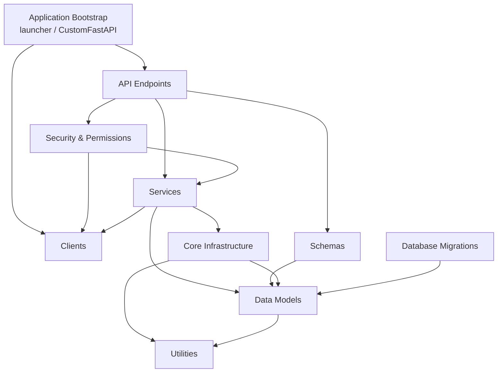

# Tap2Cloud Backend — Repository Overview

## Repository Purpose

**Tap2Cloud (t2c)** is the open-source core of an **open-core platform for Digital Product Passports (DPP)** and asset lifecycle data. It provides the infrastructure for organizations to create, manage, and exchange structured product data for sustainability reporting, regulatory compliance (e.g. the EU Battery Regulation), and circular-economy initiatives. This repository is a reusable async **FastAPI** package: downstream projects install it as a library, subclass its `CustomFastAPI`, and layer proprietary modules on top.

## Architecture Overview

The codebase is a clean layered architecture. HTTP requests flow through middleware into routers, which delegate to per-request services, which use a generic repository over SQLAlchemy models. Cross-cutting clients (JWT, storage, cryptography) are loaded as startup extensions and reached via the app.

A request lifecycle: `SQLAlchemyMiddleware` binds a DB session and service registry to the request id → the route's `JWTAPIAccessTokenBearer` verifies and re-hydrates the caller's org/roles from the DB → `get_services` wires services onto the request-scoped session → the service runs business logic through `BaseRepository` (with automatic reader/writer engine routing) → the response schema maps the ORM result to the wire format.

## Module Index

| Module | Description |
| --- | --- |
| [Application Bootstrap](application-bootstrap.md) | `CustomFastAPI` app assembly, config, lifespan, extension loader, and the Gunicorn/Uvicorn launcher |
| [Core Infrastructure](core-infrastructure.md) | Async engine with read/write routing, context-scoped sessions, `BaseRepository`, pagination, middleware, i18n |
| [Data Models](data-models.md) | SQLAlchemy ORM entities for the DPP domain (organizations, assets, asset types, typeplates, audits, users) |
| [Schemas](schemas.md) | Pydantic request/response DTOs and the JWT token classes |
| [API Endpoints](api-endpoints.md) | REST routers under `/api/v1` and their auth/DI conventions |
| [Services](services.md) | Business-logic layer, one service per domain, resolved per request |
| [Security & Permissions](security-and-permissions.md) | JWT bearers, token classes, bitmask permissions, password hashing |
| [Clients](clients.md) | Pluggable startup clients: token backend, cryptography, storage (disk/S3) |
| [Utilities](utilities.md) | Enums, the `ApplicationError` hierarchy, and misc helpers (`DictContainer`, datetime/string) |
| [Database Migrations](database-migrations.md) | Alembic async migration environment and versioned schema |
| [Tests](tests.md) | End-to-end integration test suite: ordered, stateful `TestClient` scenarios over a migrated database, with Faker fixtures and shared container pipelines |
| [Development Setup](development-setup.md) | Running the project locally: `uv` environment/dependency management and the `development/docker-compose.yml` Postgres for a zero-config local database |
| [Extending Tap2Cloud](extending.md) | How to install the core as a library and add your own models, schemas, services, clients, and endpoints in a private repo |

## Technology Stack

- **Language:** Python ≥ 3.12
- **Web framework:** FastAPI (with `fastapi-pagination`), served by Gunicorn + Uvicorn workers
- **Database:** PostgreSQL via SQLAlchemy 2.0 (async, `asyncpg`), Alembic migrations
- **Auth:** PyJWT (HS256 by default); PBKDF2-HMAC-SHA256 password hashing
- **Config:** `pydantic-settings` (environment-driven)
- **Files/PDF:** `aiofiles` disk storage (S3 backend stubbed in OSS), ReportLab for audit reports
- **i18n:** gettext + Babel (`en`/`de`)
- **Logging:** Loguru (JSON-capable) with stdlib/Gunicorn/Uvicorn interception
- **Tooling:** Ruff (lint/format), pytest (+ pytest-order, pytest-mock, Faker)

## Getting Started

The fastest path to a running local instance uses `uv` for the Python environment and the bundled Docker Compose file for the database — no external database to configure. See [Development Setup](development-setup.md) for the full walkthrough.

1. **Environment** — install dependencies with `uv sync --all-groups` (uses `.python-version` and `uv.lock` to build the `.venv`).
2. **Configuration** — the app is driven by environment variables read into `Config` (`t2c_backend/config.py`): DB connection, `APP_HOST`/`APP_PORT`, `ENVIRONMENT`, `PROJECT_NAME`, `FRONTEND_URL`, CORS origins, plus client settings (`SECRET_KEY`, `CRYPTOGRAPHY_KEY`, `STORAGE_TYPE`, `BUCKET`). A ready-to-use `.env/.env.development` is provided.
3. **Database** — start a local Postgres with `docker compose -f development/docker-compose.yml up -d` (its defaults match the sample env), then run `uv run --env-file .env/.env.development alembic upgrade head` to create the schema and seed static data. See [Development Setup](development-setup.md) and [Database Migrations](database-migrations.md).
4. **Run** — `uv run --env-file .env/.env.development python launcher.py` starts Gunicorn with Uvicorn workers; the OpenAPI docs are served by FastAPI under the app's `/api` prefix.
5. **Orientation** — start with [Application Bootstrap](application-bootstrap.md) to understand how the app is assembled and how clients/services are registered, then read [Core Infrastructure](core-infrastructure.md) (sessions, repository) and [API Endpoints](api-endpoints.md) (request flow). The [Data Models](data-models.md) ER structure is the best map of the domain.
6. **Extending** — install this package as a library, subclass `CustomFastAPI` with your own `config_class` and `get_api_router()`, and register additional clients/services via the extension `setup(app)` pattern. See the full walkthrough in [Extending Tap2Cloud](extending.md).

> **Open-core note:** some capabilities — parts of organizational management, advanced access control, enterprise identity, and the concrete S3 storage backend — are provided through separate proprietary modules and are not part of this repository.
