# Permissions Reference

## Module Overview

This is the complete catalogue of the authorization system: every permission flag defined in
`t2c_backend/core/permissions.py`, its bit position and integer value, and the exact routes that
require it. It is the lookup table companion to
[Security & Permissions](security-and-permissions.md), which explains *how* the checks run.

Everything here is derived from the source: flags come from the `@FlagValue` definitions on
`Permissions`, and the route column comes from the `JWTAPIAccessTokenBearer(permissions={...})`
dependency on each endpoint.

## How a permission becomes an HTTP decision

```mermaid
graph LR
  Role[roles.permissions<br/>NUMERIC bitmask] --> Decode[Permissions int → flags]
  Decode --> Have[set of granted flag names]
  Route[Route bearer<br/>permissions=&#123;flag: True&#125;] --> Need[set of required flag names]
  Need --> Sub{required ⊆ granted?}
  Have --> Sub
  Sub -->|yes| Handler[handler runs]
  Sub -->|no| Deny[403 Insufficient permissions.]
```



A user's granted set is the **union across all their roles** — permissions add up, they are never
subtracted. See [Security & Permissions](security-and-permissions.md) for the union semantics and the
`403` vs `401` distinction.

## Flag catalogue

42 flags are defined, occupying bits `0`–`41`. The integer value of a flag is `1 << bit`; a role's
`permissions` column is the bitwise OR of every flag it grants.

| Flag | Bit | Value | Required by |
| --- | --- | --- | --- |
| `asset_type_category_create` | 0 | `1` | `POST /asset-type-category` |
| `asset_type_category_update` | 1 | `2` | `PATCH /asset-type-category/{assetTypeCategoryId}` |
| `asset_type_category_read` | 2 | `4` | `GET /asset-type-category`<br>`GET /filter/asset-type-category`<br>`GET /asset-type-category/{assetTypeCategoryId}`<br>`GET /filter/asset-type-category/mapping` |
| `asset_type_category_delete` | 3 | `8` | `DELETE /asset-type-category/{assetTypeCategoryId}` |
| `asset_type_create` | 4 | `16` | `POST /asset-type` |
| `asset_type_update` | 5 | `32` | `PUT /asset-type/{assetTypeId}`<br>`POST /asset-type/{assetTypeId}/custom-field/documents`<br>`DELETE /asset-type/custom-field/{assetTypeId}/{documentId}` |
| `asset_type_read` | 6 | `64` | `PUT /asset-type`<br>`GET /asset-type/{assetTypeId}`<br>`GET /asset-type/{assetTypeId}/get/document/{instructionManualId}/{documentName}`<br>`GET /asset-type/{assetTypeId}/get/custom-field/document/{documentId}/{documentName}` |
| `asset_type_delete` | 7 | `128` | `DELETE /asset-type/{assetTypeId}` |
| `asset_create` | 8 | `256` | `POST /asset` |
| `asset_update` | 9 | `512` | `PUT /asset/{assetId}` |
| `asset_read` | 10 | `1024` | `PUT /asset`<br>`GET /asset/{assetId:int}` |
| `asset_delete` | 11 | `2048` | `DELETE /asset/{assetId}` |
| `typeplate_update` | 12 | `4096` | `PUT /typeplate/{typeplateId}` |
| `typeplate_read` | 13 | `8192` | `GET /typeplate/images`<br>`GET /typeplate`<br>`GET /typeplate/{typeplateId}`<br>`GET /typeplate/docuemnt/{typeplateId}/{euFileId}` |
| `service_create` | 14 | `16384` | `POST /asset/{assetId}/create/service` |
| `service_update` | 15 | `32768` | `PUT /asset/{serviceId}/update/service` |
| `service_read` | 16 | `65536` | `GET /service`<br>`GET /service/{serviceId}` |
| `service_delete` | 17 | `131072` | `DELETE /service/{serviceId}` |
| `organization_create` | 18 | `262144` | — *(defined, no route)* |
| `organization_update` | 19 | `524288` | `PUT /organization` |
| `organization_read` | 20 | `1048576` | `GET /organization` |
| `organization_delete` | 21 | `2097152` | `DELETE /organization`<br>`DELETE /user/{cascadeOrg}` *(secondary, only when `cascadeOrg` is true)*<br>`DELETE /organization/user/{userId}/{cascadeOrg}` *(secondary, only when `cascadeOrg` is true)* |
| `user_create` | 22 | `4194304` | — *(defined, no route)* |
| `user_update` | 23 | `8388608` | `PUT /user/profile` |
| `user_read` | 24 | `16777216` | `GET /organization/users` |
| `user_delete` | 25 | `33554432` | `DELETE /user/{cascadeOrg}` |
| `org_user_delete` | 26 | `67108864` | `DELETE /organization/user/{userId}/{cascadeOrg}` |
| `change_user_password` | 27 | `134217728` | `POST /user/password/change` |
| `update_location` | 28 | `268435456` | `PUT /location` |
| `get_location` | 29 | `536870912` | `GET /filter/location` |
| `get_role` | 30 | `1073741824` | `GET /organization/roles` |
| `create_role` | 31 | `2147483648` | `POST /organization/roles` |
| `list_asset_pass` | 32 | `4294967296` | `GET /asset-pass` |
| `audit_create` | 33 | `8589934592` | `POST /audit/task`<br>`POST /asset/{assetId}/audit` |
| `audit_read` | 34 | `17179869184` | `GET /audit`<br>`GET /audit/{auditId}/task/{auditTaskId}/document/{documentId}/get`<br>`GET /asset/{assetId}/audit/{auditId}/audit-report` |
| `audit_update` | 35 | `34359738368` | — *(defined, no route)* |
| `audit_delete` | 36 | `68719476736` | `DELETE /audit/{auditId}`<br>`DELETE /audit/task/{auditTaskId}` |
| `instruction_manual_create` | 37 | `137438953472` | — *(defined, no route)* |
| `instruction_manual_read` | 38 | `274877906944` | `GET /instruction-manual` |
| `instruction_manual_update` | 39 | `549755813888` | `POST /asset-type/{assetTypeId}/documents` |
| `instruction_manual_delete` | 40 | `1099511627776` | `DELETE /instruction-manual/{assetTypeId}` |
| `typeplate_document_delete` | 41 | `2199023255552` | `DELETE /typeplate/document/{typeplateId}/{documentId}` |

### Flags with no route

`organization_create`, `user_create`, `audit_update`, and `instruction_manual_create` are defined but
not required by any current route. They are reserved bits: granting them has no effect in this
repository, but they keep the bit layout stable for downstream (private) routers that do use them.

Note the naming is not perfectly uniform — `update_location` / `get_location` / `get_role` /
`create_role` / `list_asset_pass` predate the `{resource}_{action}` convention used by the rest.

## Route → permission matrix

Every route in `t2c_backend/endpoints/v1/rest`, with the permission it requires. `access` means
`JWTAPIAccessTokenBearer`, `refresh` means `JWTAPIRefreshTokenBearer`, `—` means the route is public.

### Public (no token)

| Method | Path | Notes |
| --- | --- | --- |
| `POST` | `/login` | issues the token pair |
| `POST` | `/register` | creates a user and auto-logs-in |
| `GET` | `/health` | liveness/version |
| `GET` | `/asset-pass/{passId}` | the public Digital Product Passport view |

`GET /token/refresh` sits between the two groups: it requires a valid **refresh** token via
`JWTAPIRefreshTokenBearer` but declares no permission. It could not enforce one anyway — the refresh
bearer skips the DB round-trip, so its token carries no `roles` claim to check against.

### Authenticated but unrestricted (token only, no permission flag)

| Method | Path | Why no flag |
| --- | --- | --- |
| `POST` | `/organization` | bootstrap route — the caller has just registered and holds no org roles yet, so no flag can be required |
| `GET` | `/user/profile` | every user may read their own profile (the `user_read` requirement was deliberately removed) |
| `GET` | `/product-pass-type` | static reference data |
| `GET` | `/asset-type-category-group` | static reference data |
| `GET` | `/dashboard/summary` | aggregate counts, already scoped to the caller's location/org |

### Permission-guarded

| Method | Path | Permission |
| --- | --- | --- |
| `POST` | `/asset` | `asset_create` |
| `PUT` | `/asset/{assetId}` | `asset_update` |
| `DELETE` | `/asset/{assetId}` | `asset_delete` |
| `PUT` | `/asset` | `asset_read` |
| `GET` | `/asset/{assetId:int}` | `asset_read` |
| `GET` | `/asset-pass` | `list_asset_pass` |
| `POST` | `/asset-type` | `asset_type_create` |
| `PUT` | `/asset-type/{assetTypeId}` | `asset_type_update` |
| `DELETE` | `/asset-type/{assetTypeId}` | `asset_type_delete` |
| `PUT` | `/asset-type` | `asset_type_read` |
| `GET` | `/asset-type/{assetTypeId}` | `asset_type_read` |
| `POST` | `/asset-type/{assetTypeId}/custom-field/documents` | `asset_type_update` |
| `DELETE` | `/asset-type/custom-field/{assetTypeId}/{documentId}` | `asset_type_update` |
| `GET` | `/asset-type/{assetTypeId}/get/document/{instructionManualId}/{documentName}` | `asset_type_read` |
| `GET` | `/asset-type/{assetTypeId}/get/custom-field/document/{documentId}/{documentName}` | `asset_type_read` |
| `POST` | `/asset-type-category` | `asset_type_category_create` |
| `GET` | `/asset-type-category` | `asset_type_category_read` |
| `PATCH` | `/asset-type-category/{assetTypeCategoryId}` | `asset_type_category_update` |
| `DELETE` | `/asset-type-category/{assetTypeCategoryId}` | `asset_type_category_delete` |
| `GET` | `/asset-type-category/{assetTypeCategoryId}` | `asset_type_category_read` |
| `GET` | `/filter/asset-type-category` | `asset_type_category_read` |
| `GET` | `/filter/asset-type-category/mapping` | `asset_type_category_read` |
| `POST` | `/audit/task` | `audit_create` |
| `POST` | `/asset/{assetId}/audit` | `audit_create` |
| `GET` | `/audit` | `audit_read` |
| `DELETE` | `/audit/{auditId}` | `audit_delete` |
| `DELETE` | `/audit/task/{auditTaskId}` | `audit_delete` |
| `GET` | `/audit/{auditId}/task/{auditTaskId}/document/{documentId}/get` | `audit_read` |
| `GET` | `/asset/{assetId}/audit/{auditId}/audit-report` | `audit_read` |
| `POST` | `/asset/{assetId}/create/service` | `service_create` |
| `PUT` | `/asset/{serviceId}/update/service` | `service_update` |
| `DELETE` | `/service/{serviceId}` | `service_delete` |
| `GET` | `/service` | `service_read` |
| `GET` | `/service/{serviceId}` | `service_read` |
| `GET` | `/typeplate/images` | `typeplate_read` |
| `GET` | `/typeplate` | `typeplate_read` |
| `GET` | `/typeplate/{typeplateId}` | `typeplate_read` |
| `PUT` | `/typeplate/{typeplateId}` | `typeplate_update` |
| `GET` | `/typeplate/docuemnt/{typeplateId}/{euFileId}` | `typeplate_read` |
| `DELETE` | `/typeplate/document/{typeplateId}/{documentId}` | `typeplate_document_delete` |
| `GET` | `/instruction-manual` | `instruction_manual_read` |
| `POST` | `/asset-type/{assetTypeId}/documents` | `instruction_manual_update` |
| `DELETE` | `/instruction-manual/{assetTypeId}` | `instruction_manual_delete` |
| `PUT` | `/organization` | `organization_update` |
| `GET` | `/organization` | `organization_read` |
| `DELETE` | `/organization` | `organization_delete` |
| `GET` | `/organization/roles` | `get_role` |
| `POST` | `/organization/roles` | `create_role` |
| `GET` | `/organization/users` | `user_read` |
| `PUT` | `/user/profile` | `user_update` |
| `POST` | `/user/password/change` | `change_user_password` |
| `DELETE` | `/user/{cascadeOrg}` | `user_delete` **+** `organization_delete` when `cascadeOrg` |
| `DELETE` | `/organization/user/{userId}/{cascadeOrg}` | `org_user_delete` **+** `organization_delete` when `cascadeOrg` |
| `PUT` | `/location` | `update_location` |
| `GET` | `/filter/location` | `get_location` |

## Default role grant

`OrganizationService.create_organization_with_location()` seeds one `Role` row per
`Role.organization_roles()` member (`member`, `admin`, `owner` — `super_admin` is excluded) and gives
**every one of them the full bitmask**, via the `ALL_PERMISSIONS` constant:

```python
from t2c_backend.core.permissions import ALL_PERMISSIONS

roles = {
    name: Role(name=name, organization_id=organization.id, permissions=ALL_PERMISSIONS)
    for name, value in RoleEnum.organization_roles()
}
```

`ALL_PERMISSIONS` is defined at the bottom of `core/permissions.py` and **derived from the flag
declarations** rather than written out as a literal:

```python
#: Bitmask with every flag declared on :class:`Permissions` enabled. Recomputed
#: automatically, so a newly added ``FlagValue`` is included without changes here.
ALL_PERMISSIONS = Permissions(**dict.fromkeys(Permissions.VALID_FLAGS, True)).value
```

It evaluates at import time to the bitwise OR of every declared flag — currently `4398046511103`,
which happens to equal `2**42 - 1` because bits `0`–`41` are contiguous. Note it is the OR of the
*declared* bits, not "every bit below the highest": if a future flag were allocated at, say, bit 50
leaving a gap, `ALL_PERMISSIONS` would skip the unused bits rather than granting them.

So out of the box `member`, `admin`, and `owner` are functionally identical: differentiating them means
creating narrower roles via `POST /organization/roles` or updating the `permissions` column directly.

> **What this does and doesn't cover:** because the constant is recomputed from `VALID_FLAGS`, adding a
> new `@FlagValue` automatically includes it for **newly created** organizations — no constant to bump.
> **Existing** roles are unaffected, since their `permissions` integers are already persisted; granting
> a new flag to them still needs a data migration (`UPDATE roles SET permissions = ...`). See
> [Extending Tap2Cloud](extending.md).

## Working with the bitmask

```python
from t2c_backend.core.permissions import ALL_PERMISSIONS, Permissions

# Build a value for a narrow role
p = Permissions(asset_read=True, asset_type_read=True, list_asset_pass=True)
p.value  # -> store this int in roles.permissions

# Decode a stored value
stored = Permissions(ALL_PERMISSIONS)
stored.asset_delete  # -> True
{flag for flag, on in dict(stored).items() if on}  # -> all granted flag names

# Set algebra
Permissions(asset_read=True).is_subset(stored)  # -> True
Permissions(asset_read=True) | Permissions(asset_create=True)
```

`Permissions` also supports `&`, `^`, `~`, in-place variants, `none()`, `update(**flags)`, and
`handle_overwrite(allow, deny)` (a Discord-style allow/deny overlay: `value = (value & ~deny) | allow`).
Unknown flag names raise `TypeError` in the constructor but are silently ignored by `update()`.

## Cross-references

- [Security & Permissions](security-and-permissions.md) — the bearers, the checking algorithm, token re-hydration
- [API Endpoints](api-endpoints.md) — the routes themselves and their DI conventions
- [Data Models](data-models.md) — the `roles` / `user_roles` tables backing the bitmask
- [Services](services.md) — `RoleService`, `OrganizationService` role seeding
- [Extending Tap2Cloud](extending.md) — adding a flag and guarding your own endpoints
