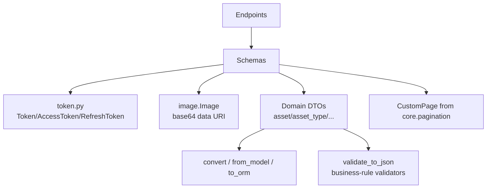
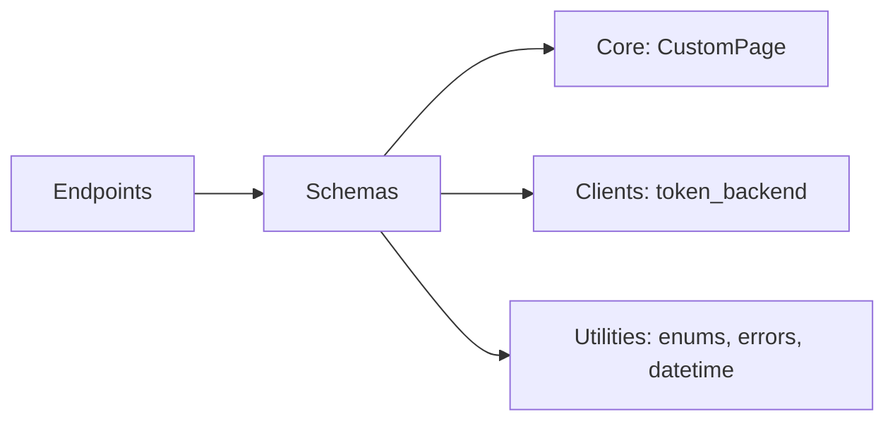

# Schemas

## Module Overview

The `schemas/v1` package holds the Pydantic request/response DTOs for the API. Nearly every schema enables `from_attributes=True` and provides explicit `convert` / `from_model` / `from_list` / `to_orm` mapper methods to translate between ORM objects and wire representations. The most distinctive members are the JWT token classes in `token.py` (used by auth) and a family of multipart-form validators.

## Architecture Diagram

## Component Descriptions

### `token.py` — auth tokens

The only non-declarative module. `Token` wraps a JWT payload dict: it decodes an incoming token via the `token_backend` (wrapping failures as `TokenError`) or seeds a fresh payload with `exp`/`iat`/`jti`; `str(token)` signs and returns the encoded JWT. Claim keys are module constants (`user_id`, `organization_id`, `location_id`, `roles`, `jti`, `token_type`). `AccessToken` (1 day) and `RefreshToken` (7 days) set `token_type`/`lifetime`. Response models: `TokenResponse` (access+refresh) and `RefreshTokenResponse` (access only). See [Security & Permissions](security-and-permissions.md).

### Domain DTOs

Each domain has request and response schemas. Highlights:

- **Asset** — `CreateAsset`/`UpdateAsset`, `AssetResponse`, lightweight `DisplayAsset`, and the digital-passport views `AssetPassResponse` / `DetailedAssetPassResponse` (aggregating asset type, category, audits, taxonomy). `SelectiveFilters` is the filter body for list endpoints.
- **Asset Type** — `CreateAssetTypeRequest`/`UpdateAssetTypeRequest` (multipart, `fields: conlist(BaseField, min_length=1)`), `AssetTypeResponse` (with `form`, instruction manuals, optional `TypeplateResponse`), plus nested `FormData`/`AssetTypeField`.
- **Asset Type Category** — `CreateAssetTypeCategoryRequest`/`UpdateAssetTypeCategoryRequest` with validators enforcing per-`InputType` option rules and rejecting duplicate field orders/names; `Field`/`FieldOption`, `AssetTypeCategoryResponse`, `DisplayAssetTypeCategory`.
- **Audit** — `CreateAuditTask`, `CreateAudit` (validates `inspection_date <= valid_until`), `AuditResponse`, `AssetAuditResponse`.
- **Service** — `CreateService` (validates `expireDate >= serviceDate`), `UpdateService`, `ServiceResponse`, `AssetServiceResponse`.
- **Organization / Location / Taxonomy** — layered inheritance; `DisplayOrganization` is the common base with two branches off it: `Organization` (adds `taxonomy`) and `DetailedOrganization → OrganizationDetails` (adds `locationCount`/`userCount`/`roleCount`). `LocationCreateRequest → LocationBaseResponse → Location`; `Taxonomy` is dual-use.
- **User** — `UserLogin`/`UserLoginResponse` (reuses `TokenResponse`), `UserRegisterRequest`, `ChangePasswordRequest`, `DisplayUser`/`UserResponse`/`OrganizationUser`, and `OrganizationUsersCustomPage` (a `CustomPage` subclass adding `extra: UserCount`).
- **Dashboard / Documents / Health / Role** — flat counters (`DashboardResponse`), `DocumentResponse`, `Health` (the only schema without `from_attributes`), `RoleBase`/`RoleCreate`.

### `image.Image`

A shared serialization helper (not a request/response DTO): async `from_file(UploadFile)` base64-encodes an upload; `get_string()` returns a `data:` URI. Reused for organization logos, user avatars, and typeplate images.

## Conventions

- **Naming** — requests are `Create*`/`Update*` (update variants usually all-optional); responses are `*Response` (full) and `Display*` (lightweight nested summaries).
- **Config** — `ConfigDict(from_attributes=True)` almost everywhere; `populate_by_name=True` on multipart schemas.
- **Aliasing** — snake_case Python attributes exposed as camelCase JSON via `Field(alias=...)`. Where a domain `Field` model exists, Pydantic's `Field` is imported as `PydanticField`.
- **Mappers** — static `convert()`/`from_model()`/`from_list()`/`to_orm()` do explicit field-by-field ORM↔schema mapping (including datetime→epoch conversion).
- **Validators** — a recurring `@model_validator(mode="before")` `validate_to_json` accepts either a raw JSON string or an uploaded file body (multipart pattern); business-rule validators raise `BadRequestError`. `conlist(..., min_length=1)` enforces non-empty nested lists.
- **Pagination** — represented via the generic `CustomPage[T]` from [Core Infrastructure](core-infrastructure.md), parameterized per response type (or subclassed to add an `extra` payload).

## Dependencies

## Cross-references

- [API Endpoints](api-endpoints.md) — where these DTOs are used as request/response models
- [Data Models](data-models.md) — the ORM entities these schemas map to
- [Security & Permissions](security-and-permissions.md) — the token classes
- [Core Infrastructure](core-infrastructure.md) — `CustomPage` pagination
