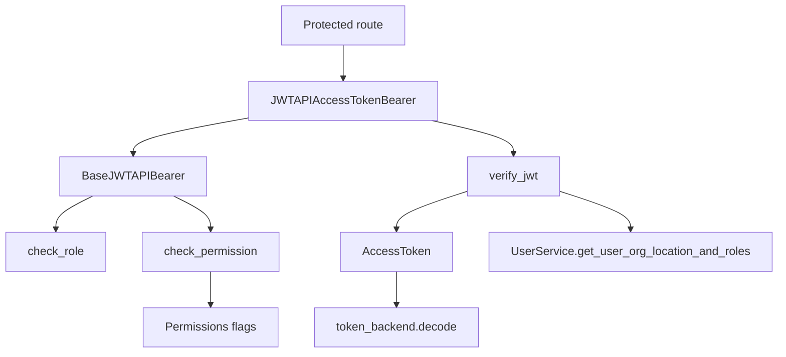
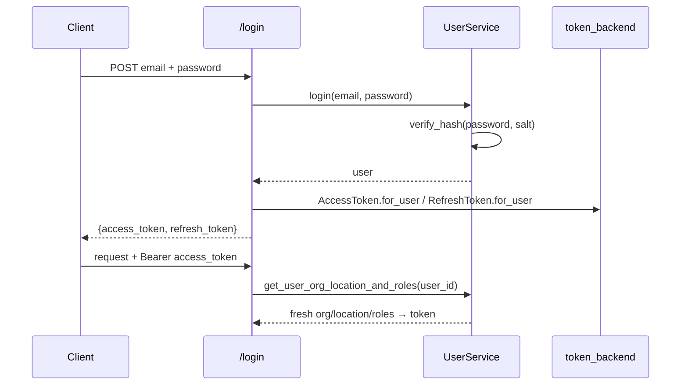
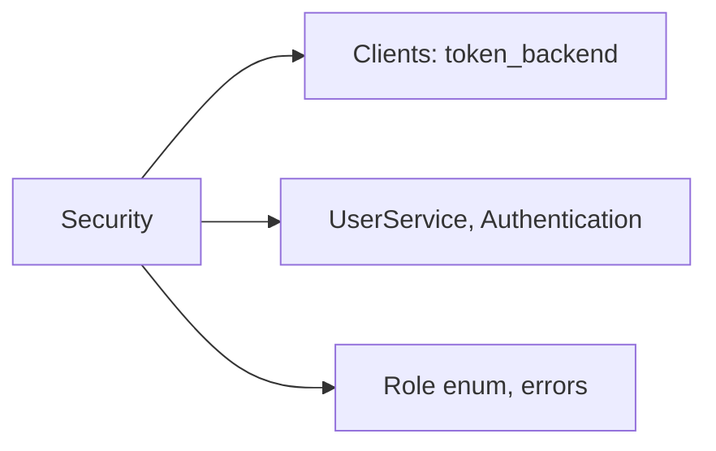

# Security & Permissions

## Module Overview

This module covers authentication and authorization: the JWT bearer dependencies that guard REST and WebSocket routes, the token classes that wrap JWT payloads, the bitmask-based `Permissions` flag system, and the password hashing performed by the authentication service. Together they implement stateless JWT auth where every request re-hydrates the caller's org/location/roles from the database.

## Architecture Diagram

## Components

### JWT bearers (`core/security.py`)

- **`BaseJWTAPIBearer`** — holds required `roles: set[Role]` and `permissions: dict[str, bool]`. `check_role()` requires the token to hold all listed roles; `check_permission()` decodes each role's `permissions` bitmask into `Permissions` flags and verifies the required flags are a subset. `verify_jwt()` is abstract.
- **`JWTAPIBearer(BaseJWTAPIBearer, HTTPBearer)`** — the REST dependency. On call it extracts the `Bearer` credential, enforces the scheme, calls `verify_jwt()`, then applies role and permission checks (raising `UnAuthorizedError` / `UnAuthenticatedError`).
- **`JWTAPIAccessTokenBearer`** — verifies an **access** token and, crucially, **re-hydrates** it: it opens a fresh DB session and calls `UserService.get_user_org_location_and_roles(user_id)`, so `token.organization_id`, `token.location_id`, and `token.roles` are always current. This is the dependency used by essentially every protected route.
- **`JWTAPIRefreshTokenBearer`** — verifies a **refresh** token (no DB round-trip); used only by `/token/refresh`.
- **`JWTWebSocketBearer` / `JWTWebSocketAccessTokenBearer` / `JWTWebSocketRefreshTokenBearer`** — WebSocket equivalents that read the token from a query param and raise `WebSocketException` on failure. Defined but not used by the current REST routers.

> All REST routes instantiate the bearer with **no arguments** (authentication only). Per-resource authorization is enforced inside services or via explicit `UnAuthorizedError` raises (e.g. the organization role endpoints check `token.organization_id`). The role/permission machinery is available but not wired into the open-source routes.

### Token classes (`schemas/v1/token.py`)

`Token` is a hand-rolled JWT wrapper (not a Pydantic model) over a payload dict:

- Construction either decodes an existing token (via `token_backend.decode`, wrapping failures as `TokenError`) or seeds a fresh payload with `exp`, `iat`, and `jti`.
- `str(token)` **signs and returns the encoded JWT** (`token_backend.encode(payload)`).
- `verify()` enforces expiry (`check_exp`, honoring the backend's leeway), a present `jti`, and the correct `token_type`.
- `for_user(user, token_backend)` seeds `user_id`; convenience properties expose `user_id`, `organization_id`, `location_id`, `roles`; `update_payload()` merges claims (used to inject the re-hydrated org/roles).
- **`AccessToken`** — `token_type="access"`, 1-day lifetime. **`RefreshToken`** — `token_type="refresh"`, 7-day lifetime.
- Response models `TokenResponse` (`access_token` + `refresh_token`) and `RefreshTokenResponse` (`access_token`).

### Permissions (`core/permissions.py`)

A Discord-style bitmask flag system:

- `BaseFlags` + the `FlagValue` descriptor + `@fill_with_flags()` decorator build a class where each permission is a single bit accessed as a boolean attribute. Supports `|`, `&`, `^`, `~`, `is_subset`/`is_superset`, `update()`, and `handle_overwrite(allow, deny)`.
- `Permissions` defines ~26 flags as `1 << n` covering CRUD on `asset_type_category`, `asset_type`, `asset`, `typeplate`, `service`, `organization`, and `user`. A role's integer `permissions` column is decoded into these flags for `check_permission()`.

### Password hashing (`services/authentication`)

The `Authentication` service (session-less, no repository) provides `generate_encoded_password()` (random 32-byte salt + PBKDF2-HMAC-SHA256, 100k iterations, base64 salt+key) and `verify_hash()` for login. It also builds frontend verification/reset links from `FRONTEND_URL`. See [Services](services.md).

## Authentication flows

## Dependencies

## Cross-references

- [Clients](clients.md) — the `TokenBackend` doing encode/decode
- [Services](services.md) — `UserService.login`, `Authentication` hashing
- [API Endpoints](api-endpoints.md) — login/register/refresh routes and how bearers guard routes
- [Utilities](utilities.md) — the `Role` enum and auth error classes
