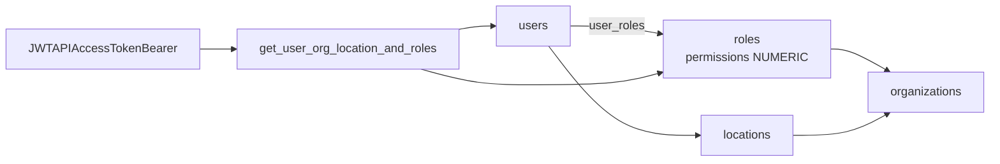
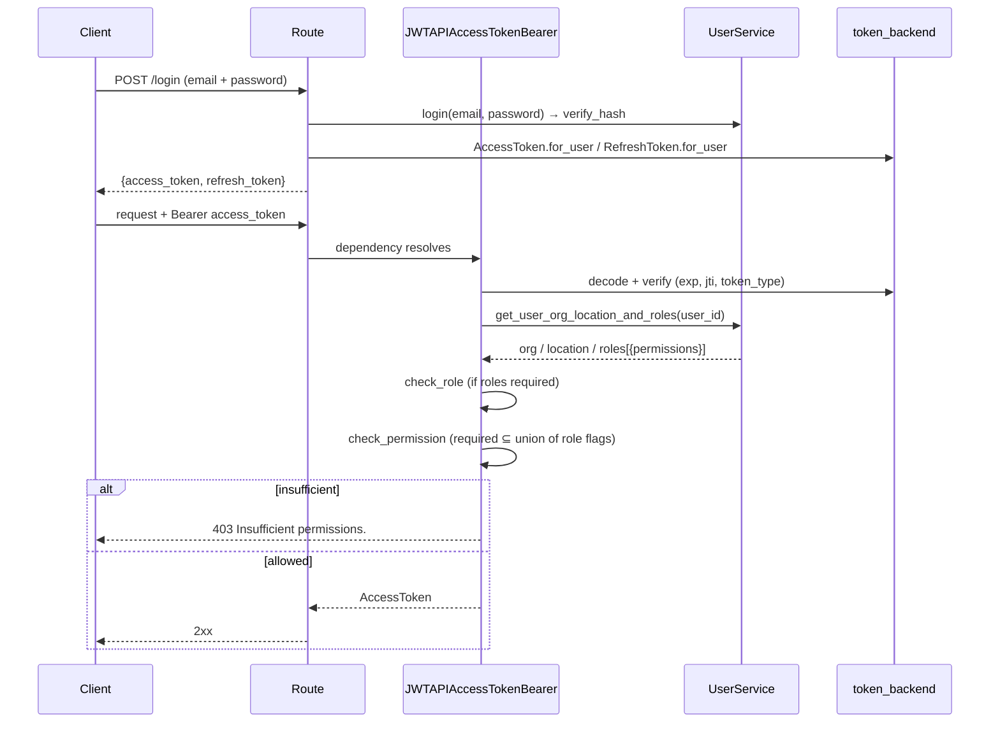
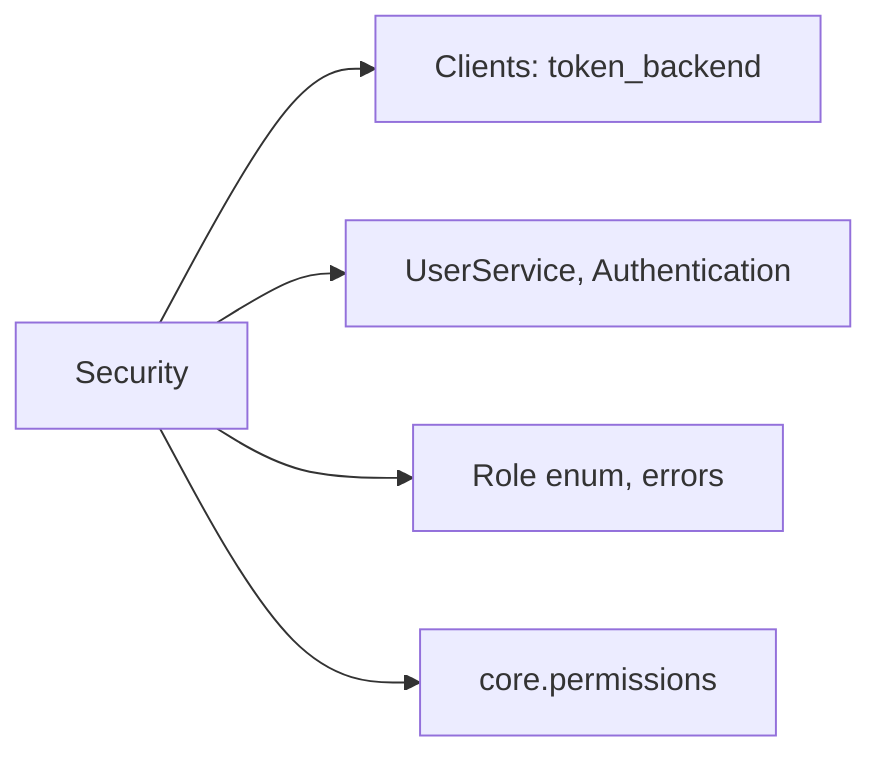

# Security & Permissions

## Module Overview

This module covers authentication and authorization: the JWT bearer dependencies that guard REST and
WebSocket routes, the token classes that wrap JWT payloads, the bitmask-based `Permissions` flag
system, and the password hashing performed by the authentication service. Together they implement
stateless JWT auth where every request re-hydrates the caller's org/location/roles from the database
and then checks the route's required permission flags against them.

Authorization is **wired into the routes**: 55 of the 60 authenticated routes declare the permission
flag they need on their bearer dependency (the five exceptions — org bootstrap, own profile, two static
reference lookups, and the dashboard summary — are listed in
[Permissions Reference](permissions-reference.md#authenticated-but-unrestricted-token-only-no-permission-flag)).
That file also holds the complete flag catalogue and route matrix.

## Architecture Diagram

```mermaid
graph TD
  Route[Protected route] --> Bearer[JWTAPIAccessTokenBearer<br/>permissions=&#123;flag: True&#125;]
  Bearer --> Base[BaseJWTAPIBearer]
  Bearer --> Verify[verify_jwt]
  Verify --> AT[AccessToken]
  AT --> TB[token_backend.decode]
  Verify --> US[UserService.get_user_org_location_and_roles]
  US --> Payload[org / location / roles + permissions]
  Base --> CheckRole[check_role]
  Base --> UP[user_permissions]
  UP --> Perms[Permissions bitmask → flag set]
  Base --> CheckPerm[check_permission<br/>required ⊆ granted]
  CheckPerm --> Handler[handler]
```



## Components

### JWT bearers (`core/security.py`)

- **`BaseJWTAPIBearer`** — holds the route's requirements: `roles: set[Role]` and
  `permissions: dict[str, bool]`. Both default to empty, and each check is skipped when its
  requirement set is empty. `verify_jwt()` is abstract.
- **`JWTAPIBearer(BaseJWTAPIBearer, HTTPBearer)`** — the REST dependency. Extracts the `Bearer`
  credential, enforces the scheme, calls `verify_jwt()`, then applies the role check and the
  permission check.
- **`JWTAPIAccessTokenBearer`** — verifies an **access** token and **re-hydrates** it: it opens a fresh
  DB session and calls `UserService.get_user_org_location_and_roles(user_id)`, so
  `token.organization_id`, `token.location_id`, and `token.roles` (including each role's
  `permissions` bitmask) are always current. This is the dependency used by every protected route, and
  the reason a permission change takes effect on the caller's **next request** without re-login.
- **`JWTAPIRefreshTokenBearer`** — verifies a **refresh** token (no DB round-trip, so no roles and no
  permission checking); used only by `GET /token/refresh`.
- **`JWTWebSocketBearer` / `JWTWebSocketAccessTokenBearer` / `JWTWebSocketRefreshTokenBearer`** —
  WebSocket equivalents that read the token from a `token` query param and raise `WebSocketException`
  (code `1008`) on failure. They accept the same `roles`/`permissions` arguments, but note that
  `JWTWebSocketBearer.__call__` only verifies the token — it does **not** invoke `check_role` /
  `check_permission`. No WebSocket routes ship in this repository.

### How a route declares its requirement

Authorization is declarative — the flag name is part of the dependency:

```python
@router.delete("/asset/{assetId}", operation_id="delete asset", status_code=204)
async def delete_asset_handler(
    asset_id: int = Path(..., alias="assetId"),
    token: AccessToken = Depends(JWTAPIAccessTokenBearer(permissions={"asset_delete": True})),
    services: DictContainer = Depends(get_services),
):
    ...
```

The dict form is deliberate: `permissions={"asset_delete": True}` — only entries whose value is truthy
**and** whose key is a real flag name are required.

### The checking algorithm

```python
@staticmethod
def user_permissions(token: "Token"):
    return {
        flag
        for role in token.roles
        for flag, check in dict(Permissions(int(role["permissions"]))).items()
        if check
    }

def check_permission(self, token: "Token") -> bool:
    user_permissions = self.user_permissions(token)
    valid_checked_permissions = {
        permission
        for permission, check in self.permissions.items()
        if check and permission in Permissions.VALID_FLAGS
    }
    return set(valid_checked_permissions).issubset(user_permissions)
```

Three properties follow directly from this code and are worth knowing:

1. **Roles are additive (union, not intersection).** Each role's numeric bitmask is decoded to flag
   names and the sets are unioned. A user with a narrow role *and* a broad role has the broad role's
   powers — there is no deny.
2. **Unknown flag names are ignored, not rejected.** The `permission in Permissions.VALID_FLAGS`
   filter drops typos, so a misspelled requirement silently guards nothing. Only names that exist on
   `Permissions` can protect a route.
3. **Empty requirement ⇒ no check.** `if self.permissions and not self.check_permission(token)` — a
   bearer constructed with no `permissions` authenticates only.

`check_role()` is the parallel mechanism for the `Role` enum (`all(...)` — the token must hold *every*
listed role). No current route passes `roles=`; the permission flags are the mechanism in use.

### Two-level checks (compound operations)

Some operations do more than their primary flag implies, so the handler adds a second check using the
same static helper. Deleting a user with `cascadeOrg` can tear down the whole organization, so it also
requires `organization_delete`:

```python
if cascade_org and not {"organization_delete"}.issubset(
    JWTAPIAccessTokenBearer.user_permissions(token)
):
    raise UnAuthenticatedError("Insufficient permissions.")
```

Both `DELETE /user/{cascadeOrg}` and `DELETE /organization/user/{userId}/{cascadeOrg}` use this
pattern. `user_permissions()` is a `@staticmethod` precisely so handlers can reuse the decoding logic
without constructing a bearer. This is the pattern to copy whenever a request parameter escalates the
blast radius of an endpoint beyond what its declared flag covers.

### Failure responses

| Condition | Exception | HTTP |
| --- | --- | --- |
| Missing/malformed `Authorization` header, non-`Bearer` scheme | `UnAuthorizedError("Invalid authorization code." / "Invalid authentication scheme.")` | **401** |
| Expired, tampered, or wrong-type token (`TokenError` wrapped) | `UnAuthorizedError` | **401** |
| Authenticated but lacking a required role | `UnAuthenticatedError("Insufficient roles.")` | **403** |
| Authenticated but lacking a required permission | `UnAuthenticatedError("Insufficient permissions.")` | **403** |

Note the naming is inverted relative to the HTTP semantics: `UnAuthorizedError` → 401
(*unauthenticated*), `UnAuthenticatedError` → 403 (*unauthorized*). Both are `ApplicationError`
subclasses rendered by the central `application_exception_handler`. See [Utilities](utilities.md).

### Where permissions are stored

Permissions live on the **role**, not the user: `roles.permissions` is a `NUMERIC` column
(`Mapped[int]`, default `0`), scoped to an organization, joined to users through `user_roles`.



`UserService.get_user_org_location_and_roles()` outer-joins `User → Location → Organization` and
`User → roles`, returning `{"user_id", "location_id", "organization_id", "roles": [{"id", "name",
"permissions"}, ...]}`, which is merged into the token payload. Because the column is `NUMERIC`, the
value arrives as a `Decimal` and is coerced with `int(role["permissions"])` before decoding.

New organizations get all three default roles with the **full** bitmask — the `ALL_PERMISSIONS`
constant, derived from `Permissions.VALID_FLAGS` rather than hard-coded. See
[Permissions Reference](permissions-reference.md#default-role-grant) for the consequences.

> **Known gap:** `POST /organization/roles` accepts `RoleCreate.permissions: list[str]`, but
> `RoleService.create_role_by_organisation_id()` only persists `name` and `organization_id` — the
> submitted permission list is discarded and the new role is created with the column default `0`. A
> role created through the API therefore grants nothing until its `permissions` value is set. Custom
> permission sets must currently be written by a downstream/private module or directly in the database.

### Permissions flag machinery (`core/permissions.py`)

A Discord-style bitmask flag system:

- `BaseFlags` + the `FlagValue` descriptor + the `@fill_with_flags()` decorator build a class where
  each permission is a single bit exposed as a boolean attribute. `fill_with_flags` collects
  `VALID_FLAGS` (name → bit) and sets `DEFAULT_VALUE` (`0` here, since `inverted=False`).
- Supported operations: `|`, `&`, `^`, `~`, the in-place variants, `is_subset`/`is_superset` (aliased
  to `<=`/`>=`), `is_strict_subset`/`is_strict_superset` (`<`/`>`), `none()`, `update(**flags)`,
  `handle_overwrite(allow, deny)`, and iteration yielding `(flag_name, bool)` pairs — which is what
  `dict(Permissions(value))` in the bearer relies on.
- `AliasFlagValue` / `PermissionAlias` / `make_permission_alias()` exist to define alias flags that
  iteration skips. No aliases are currently defined.
- `Permissions` itself defines **42 flags** as `1 << n` (bits `0`–`41`) covering CRUD on
  `asset_type_category`, `asset_type`, `asset`, `typeplate`, `service`, `organization`, `user`,
  `audit`, and `instruction_manual`, plus the role/location/passport/password operations. The full
  table is in [Permissions Reference](permissions-reference.md).
- **`ALL_PERMISSIONS`** — a module-level constant holding every declared flag enabled
  (`Permissions(**dict.fromkeys(Permissions.VALID_FLAGS, True)).value`, currently `4398046511103`).
  Because it is computed from `VALID_FLAGS` at import time, adding a `FlagValue` extends it
  automatically. It is what `OrganizationService` seeds default roles with.

### Token classes (`schemas/v1/token.py`)

`Token` is a hand-rolled JWT wrapper (not a Pydantic model) over a payload dict:

- Construction either decodes an existing token (via `token_backend.decode`, wrapping failures as
  `TokenError`) or seeds a fresh payload with `exp`, `iat`, and `jti`.
- `str(token)` **signs and returns the encoded JWT** (`token_backend.encode(payload)`).
- `verify()` enforces expiry (`check_exp`, honoring the backend's leeway), a present `jti`, and the
  correct `token_type`.
- `for_user(user, token_backend)` seeds `user_id`; convenience properties expose `user_id`,
  `organization_id`, `location_id`, `roles`; `update_payload()` merges claims — this is how the
  re-hydrated org/location/roles (and therefore the permission bitmasks) enter the token.
- **`AccessToken`** — `token_type="access"`, 1-day lifetime. **`RefreshToken`** —
  `token_type="refresh"`, 7-day lifetime.
- Response models `TokenResponse` (`access_token` + `refresh_token`) and `RefreshTokenResponse`
  (`access_token`).

> The issued JWT does **not** carry permissions. They are read from the database on every request, so
> revoking a permission is effective immediately rather than at token expiry.

### Password hashing (`services/authentication`)

The `Authentication` service (session-less, no repository) provides `generate_encoded_password()`
(random 32-byte salt + PBKDF2-HMAC-SHA256, 100k iterations, base64 salt+key) and `verify_hash()` for
login. It also builds frontend verification/reset links from `FRONTEND_URL`. See
[Services](services.md).

## Authentication & authorization flow



## Ownership scoping vs permissions

Permissions answer *"may this caller perform this kind of operation?"* — they say nothing about *which
rows*. Row scoping is a separate, **location-based** mechanism: handlers pass `token.location_id` (or
`token.organization_id`) into the service, which filters and validates ownership, raising
`NotFoundError` on a mismatch:

```python
if not db_asset_type_category or db_asset_type_category.location_id != location_id:
    raise NotFoundError(...)
```

Asset types, asset type categories, documents, typeplate documents, and audits are all owned by a
`location`; their `user_id` column is a "created by" acknowledgement only (`ON DELETE SET NULL`) and
is never used for scoping. Both layers must hold: the right flag **and** a row in the caller's
location. See [Data Models](data-models.md) and [Services](services.md).

## Dependencies



## Cross-references

- [Permissions Reference](permissions-reference.md) — every flag, its bit value, and the routes requiring it
- [Clients](clients.md) — the `TokenBackend` doing encode/decode
- [Services](services.md) — `UserService.login`, role hydration, `RoleService`, `Authentication` hashing
- [API Endpoints](api-endpoints.md) — login/register/refresh routes and how bearers guard routes
- [Data Models](data-models.md) — `Role`, `UserRole`, and location-based ownership
- [Utilities](utilities.md) — the `Role` enum and auth error classes
- [Extending Tap2Cloud](extending.md) — adding your own flags and guarding custom endpoints
