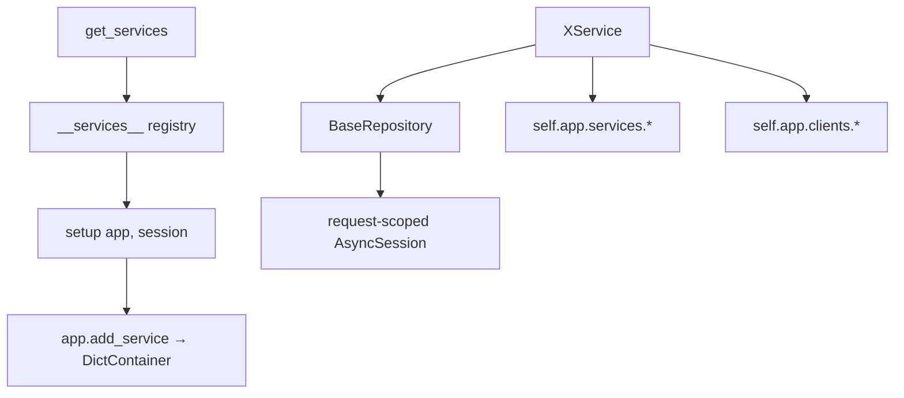
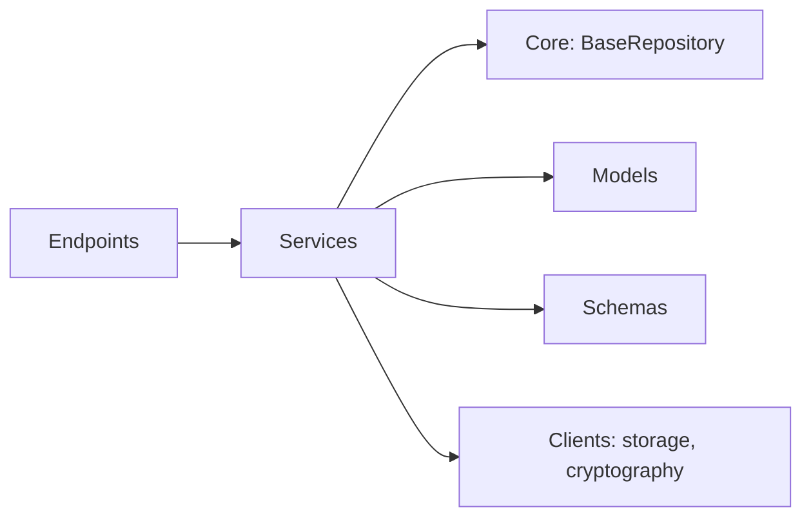

# Services

## Module Overview

The `services` package is the business-logic layer between routers and the data layer. Each domain service wraps one primary model in a `BaseRepository`, is constructed per-request with the request-scoped DB session, and is resolved through the session-based `DictContainer` (`app.services.<name>_service`). Services reach peers and external clients through the app (`self.app.services.*`, `self.app.clients.*`).

## Architecture Diagram



## Conventions

Every domain service follows an identical shape:

```python
class XService:
    _model = SomeModel
    def __init__(self, app, session):
        self.app = app
        self.repository = BaseRepository(app, session, self._model)
```

- **Registration** — each module exposes `setup(app, session, ...)` that calls `app.add_service(XService(app, session), session.info["session_id"])`. The registry key is `underscore(ClassName)` (e.g. `AssetService → asset_service`).
- **Resolution** — `services/__init__.py` builds the `__services__` list of `(class, setup)` pairs and exposes `get_services()`, which wires every service onto the request's session and returns `app.services`. There is **no shared base class** — the pattern is duck-typed convention.
- **Peer calls** — services reuse each other's `.repository` directly (e.g. `OrganizationService` uses `user_service.repository`, `role_service.repository`), sharing the same session-scoped instances.
- **Pagination** — list methods use `fastapi_pagination.ext.sqlalchemy.apaginate` with `CustomParams`/`CustomPage` and a `transformer` mapping ORM rows to `schemas.v1` responses.

## Component Descriptions

### Auth & identity

- **`Authentication`** — the only session-less service (no repository). `generate_encoded_password()` (random salt + PBKDF2-HMAC-SHA256, 100k iterations), `verify_hash()`, and frontend link builders for email verification / password reset (`FRONTEND_URL`).
- **`UserService`** (`User`) — `get_user_org_location_and_roles()` (**auth-critical**: outer-joins `User → Location → Organization` and `User → roles`, returning the org/location ids plus each role's `permissions` bitmask; this is what the bearer merges into the token on every request), `login`, `register_user`, `change_password`, `get_user_profile`, `update_user_profile`, `delete_user`, and `organization_user_handler` (paginated/filterable org-user listing with status counts, aggregating roles and permissions via `jsonb_build_object`).
  - `delete_user(user_id, organization_id, cascade_org)` first verifies the target belongs to the caller's organization *through its location* (`db_user.location.organization_id != organization_id → NotFoundError`). If **other users remain** in the org it simply deletes the user. If it is the **last** user, it either deletes the whole organization (`cascade_org=True`) or raises `BadRequestError("Unable to delete this user")`. The org-deleting branch is why the endpoints demand `organization_delete` on top of their own permission flag — see [Security & Permissions](security-and-permissions.md).
- **`UserEmailTokenService`** (`UserEmailToken`) — `create_token(user_id, TokenType)` issues one-time email/reset tokens.
- **`RoleService`** (`Role`) — `get_roles_by_organisation_id()` and `create_role_by_organisation_id()`. Note the latter persists **only** `name` and `organization_id`: the `permissions: list[str]` field on the `RoleCreate` payload is accepted by the API and then dropped, so an API-created role starts with the column default `0` and grants nothing. See [Permissions Reference](permissions-reference.md).

### Tenancy

- **`OrganizationService`** (`Organization`) — `create_organization_with_location()` bootstraps an org, its default roles (`Role.organization_roles()` — `member`/`admin`/`owner`, each seeded with the **full permission bitmask** `ALL_PERMISSIONS` from `core.permissions`), and its first location (assigning the user `owner`); plus update/get (with computed counts)/delete. `ALL_PERMISSIONS` is derived from `Permissions.VALID_FLAGS` at import time, so a newly declared flag is granted to new organizations without touching this service — see [Permissions Reference](permissions-reference.md#default-role-grant).
- **`LocationService`** (`Location`) — create/update/list locations and user-location lookups.
- **`ProductPassTypeService`** (`ProductPassType`) — read-only product pass type listing.

### Asset definition

- **`AssetTypeCategoryService`** (`AssetTypeCategory`) — manages the reusable category templates (dynamic form definitions with grouped fields and options); create/update/get/list with duplicate-order guards; maps `IntegrityError → AlreadyExistsError`. Every method takes a `location_id` and filters/validates on it (`db_row.location_id != location_id → NotFoundError`) — categories are shared by all users at a location.
- **`AssetTypeService`** (`AssetType`) — the most document-heavy service: builds asset types from a category template, manages custom fields, typeplates, EU files, instruction manuals, and per-field media through `app.clients.storage.save_document` keyed by `DocumentFor`. Provides streaming document downloads. Like categories, asset types are scoped by `location_id`; `user_id` is recorded as created-by only.
- **`TypeplateService`** (`Typeplate`) — manages product typeplates (EU declaration files, test results, image mappings); list/get/update/delete with storage-backed documents.

### Asset operations

- **`AssetService`** (`Asset`) — CRUD and listing; generates the passport `pass_id` via `app.clients.cryptography.encode(f"{location.id}_{device_id}")`; deep eager-loaded `list_asset_pass` / `get_asset_pass_by_pass_id` for public passport views.
- **`ServiceService`** (`Service`) — maintenance/service records; validates asset ownership by location and blocks editing expired services (`aware_utcnow()`).
- **`AuditService`** (`Audit`) — inspection audits, tasks, and documents; generates a **localized landscape-A4 PDF report** with ReportLab + Babel + i18n `_()`, with color-coded task statuses.

### Aggregation

- **`DashboardService`** — atypical (`_model = None`, uses `self.session` directly): `get_dashboard_statistics()` returns a 6-tuple of counts — assets, asset types, typeplates, instruction manuals, services, and inspection tasks. Every count reaches the organization through `Location` rather than through the creating user: asset types and typeplates join `AssetType.location_id`, and audit tasks join `Audit → Asset → Location`. The former cross-organization "shop" count (same-product-pass-type assets in other orgs) has been removed along with its response field.

## Dependencies



## Key APIs

```python
# Inside a route, services are resolved by name off the request-scoped container:
user = await services.user_service.login(email, password)
ctx  = await services.user_service.get_user_org_location_and_roles(user.id)

# Cross-service reuse shares the session-scoped repositories:
await self.app.services.role_service.repository.save_all(default_roles)
```

## Cross-references

- [Core Infrastructure](core-infrastructure.md) — `BaseRepository`, sessions, pagination
- [Data Models](data-models.md) — the entities services persist
- [Security & Permissions](security-and-permissions.md) — how the flag check relates to the location scoping done here
- [Permissions Reference](permissions-reference.md) — the flag catalogue and the default role grant
- [Clients](clients.md) — storage and cryptography clients used by services
- [API Endpoints](api-endpoints.md) — the routes that call these services
- [Application Bootstrap](application-bootstrap.md) — service registration via `add_service`
