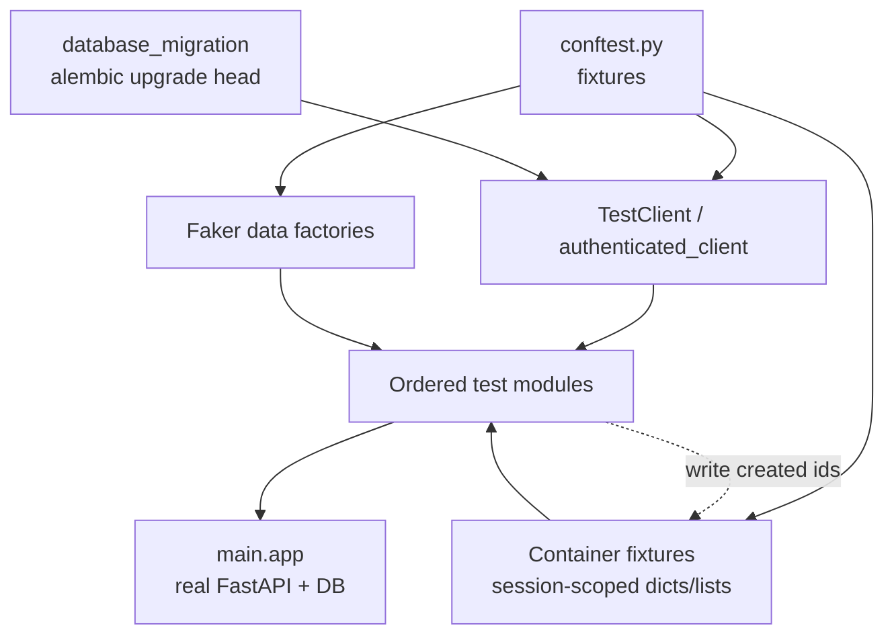
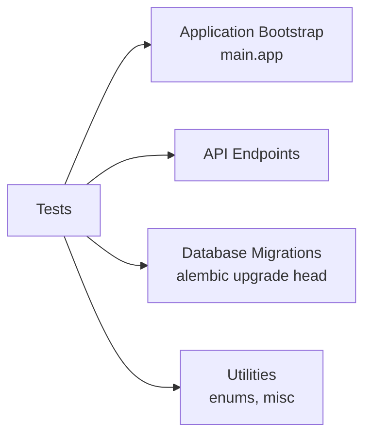

# Tests

## Module Overview

The `t2c_backend/tests` package is an **end-to-end integration test suite** that exercises the REST API through FastAPI's `TestClient` against a real, migrated database. Rather than unit-testing components in isolation, the suite boots the actual `main.app`, applies Alembic migrations, and drives the full request lifecycle (middleware → auth → services → repository → DB) for every `/api/v1` endpoint. Tests are **globally ordered** and **stateful**: they run as one long scripted scenario (register → authenticate → create organization → create asset types → create assets → services → audits → cleanup), sharing data between test files through container fixtures.

## Layout

```
t2c_backend/tests/
├── conftest.py                     # All shared fixtures (Faker factories, clients, containers)
├── utils/
│   └── misc.py                     # Pagination helper model
├── fakes/
│   └── clients/                    # Stubs for external clients (e.g. payment provider)
└── app/
    └── endpoints/v1/rest/          # One test module per REST resource
        ├── test_health.py
        ├── test_register.py
        ├── test_authentication.py
        ├── test_taxonomy.py
        ├── test_organization.py
        ├── test_location.py
        ├── test_user.py
        ├── test_asset_type_category.py
        ├── test_asset_type.py
        ├── test_asset.py
        ├── test_service.py
        ├── test_typeplate.py
        ├── test_audit.py
        └── test_instruction_manual.py
```

The test directory mirrors the production endpoint tree (`app/endpoints/v1/rest`), so each router has a co-located test module. There are ~180 test functions across 14 REST modules.

## Architecture

The suite is built from three collaborating pieces: **fixtures** that produce clients and fake data, **container fixtures** that carry created entities forward, and **ordered test modules** that read and write those containers in sequence.



## How It Works

### Real app, real database

`conftest.py` imports the production application directly:

```python
from main import app
from fastapi.testclient import TestClient

@pytest.fixture(scope="session")
def database_migration() -> None:
    alembic_args = ["--raiseerr", "upgrade", "head"]
    alembic.config.main(argv=alembic_args)

@pytest.fixture(scope="session")
def client(database_migration) -> Generator:
    with TestClient(app) as c:
        yield c
```

Every client fixture depends on `database_migration`, so the schema (and any seeded static data) is created once per session before requests are made. Because `TestClient` runs the app's lifespan, startup clients (JWT, cryptography, storage) are wired up exactly as in production.

### Two client fixtures

| Fixture | Purpose |
| --- | --- |
| `client` | Unauthenticated client — used for health checks, register/login flows, and negative auth tests (expecting `401`/`422`). |
| `authenticated_client` | Logs in with `user_data["credentials"]` and pre-sets the `Authorization: Bearer <token>` header for every request. |

Both are **session-scoped**, so the same client (and its auth header) persists across all test modules.

### Fake data with Faker

`conftest.py` centralizes payload generation with a session-scoped `Faker(locale="fr_FR")` instance. Data fixtures fall into two shapes:

- **`session`-scoped fixtures** (e.g. `user_data`, `asset`, `asset_type`, `audit`) — produced once and reused, so the same identity/entity is referenced consistently across the ordered scenario.
- **`function`-scoped fixtures** (e.g. `location`, `organization`, `asset_type_category`, `update_asset`) — regenerated per test, used where each test needs fresh input or a distinct update payload.

A `user_data_factory` builds nested credential/basics dicts, and `user_data` / `second_user_data` use it to model two independent users (the suite verifies multi-tenant isolation by creating parallel data for a second user).

### Container fixtures — the data pipeline

The distinguishing pattern of this suite is the **container fixture**: an empty session-scoped `dict` or `list` that tests mutate to pass created entities downstream.

```python
@pytest.fixture(scope="session")
def container():
    return {}

# In test_organization.py — write:
container["organization_id"] = response.json()["id"]

# Later in test_asset.py — read:
"location": container["location"],
```

Because these are session-scoped, a value written by an early test is visible to every later test. Containers include `container`, `taxonomy_container`, `asset_type_container`, `asset_container`, `asset_type_category_mapping_container`, `typeplate_container`, `service_container`, `audit_container`, `organization_container`, and others. This is what lets, for example, `test_asset.py` create an asset that references an organization created back in `test_organization.py` and an asset type created in `test_asset_type.py`.

### Global ordering with pytest-order

Because tests depend on entities created by earlier tests, execution order is fixed with the **`pytest-order`** plugin via `@pytest.mark.order(N)`. The numbers form a single global sequence spanning all files:

```python
@pytest.mark.order(1)   # test_register.py       — create users
@pytest.mark.order(2)   # test_authentication.py — log in
@pytest.mark.order(3)   # test_taxonomy.py       — load taxonomies
@pytest.mark.order(4)   # test_organization.py   — create org (+ store id in container)
...
@pytest.mark.order(40)  # test_asset.py          — create assets
...
@pytest.mark.order(124) # test_organization.py   — read/update org near the end
```

Unmarked tests (mostly negative cases like "without password", "unauthenticated client") are order-independent and run without a fixed position. The high tail numbers (e.g. `124`, `125`) are deliberately placed late so read/update/delete assertions execute after all creation steps.

### Faking external clients

`tests/fakes/clients/` holds stand-ins for third-party integrations (such as a payment provider) so tests never hit external services. Combined with `pytest-mock`, dependencies are swapped for deterministic fakes during the run. The concrete integrations these fakes replace live in proprietary modules outside this repository.

### Helpers

`tests/utils/misc.py` provides a small `Pagination` Pydantic model (`page`, `pagesize`) used by the `create_pagination` fixture to exercise paginated list endpoints.

## Assertion Style

Tests assert on HTTP semantics rather than internal state:

- **Success:** `assert response.status_code == 200` (or `201` for creates).
- **Validation errors:** `assert response.status_code == 422` for malformed/missing-field payloads.
- **Auth:** `assert response.status_code == 401` when calling protected routes with the unauthenticated `client`.
- **Response shape:** subset checks like `assert {"refresh_token", "access_token"} <= response.json().keys()`.

## Configuration

Test discovery and paths are configured in `pyproject.toml`:

```toml
[tool.pytest.ini_options]
pythonpath = [".", "t2c_backend"]
testpaths = ["t2c_backend/tests"]

[dependency-groups]
test = [
    "faker>=40.28.1",
    "pillow>=12.3.0",
    "pytest>=9.1.1",
    "pytest-mock>=3.15.1",
    "pytest-order>=1.5.0",
]
```

The `pythonpath` entries let tests import production modules by their short package names (`from main import app`, `from utils.enums import ...`). `pillow` supports image-upload tests (e.g. `fake.image()` for organization logos).

## Running the Tests

```bash
# Install the test dependency group, then:
pytest                      # runs the full ordered suite against a migrated DB
pytest t2c_backend/tests/app/endpoints/v1/rest/test_health.py   # a single module
```

> **Note:** Because of the shared-container/global-order design, running an isolated subset of ordered tests may fail on missing prerequisite data — the suite is intended to run as a whole. A test database reachable by the app's `Config` must be available for the `alembic upgrade head` migration step.

## Dependencies



The suite touches nearly every module transitively — booting `main.app` pulls in [Application Bootstrap](application-bootstrap.md), and each request flows through [API Endpoints](api-endpoints.md), [Services](services.md), [Core Infrastructure](core-infrastructure.md), and [Data Models](data-models.md). The migration fixture depends on [Database Migrations](database-migrations.md), and fixtures import enums/helpers from [Utilities](utilities.md).

## Cross-references

- [API Endpoints](api-endpoints.md) — the routers each test module targets
- [Application Bootstrap](application-bootstrap.md) — how `main.app` is assembled and its lifespan runs under `TestClient`
- [Database Migrations](database-migrations.md) — the `alembic upgrade head` invoked by the `database_migration` fixture
- [Security & Permissions](security-and-permissions.md) — the JWT flow behind `authenticated_client`
- [Overview](overview.md) — repository-wide architecture
