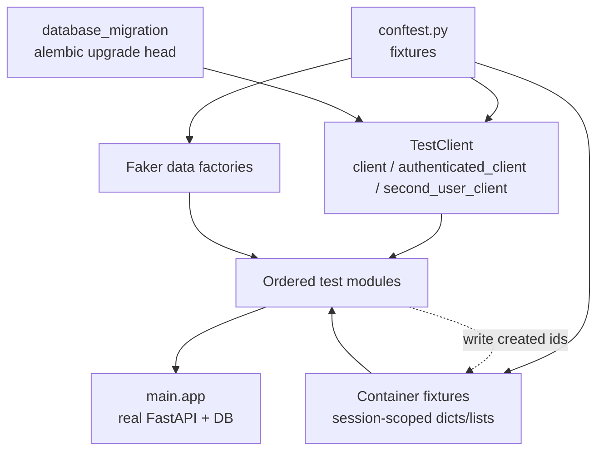
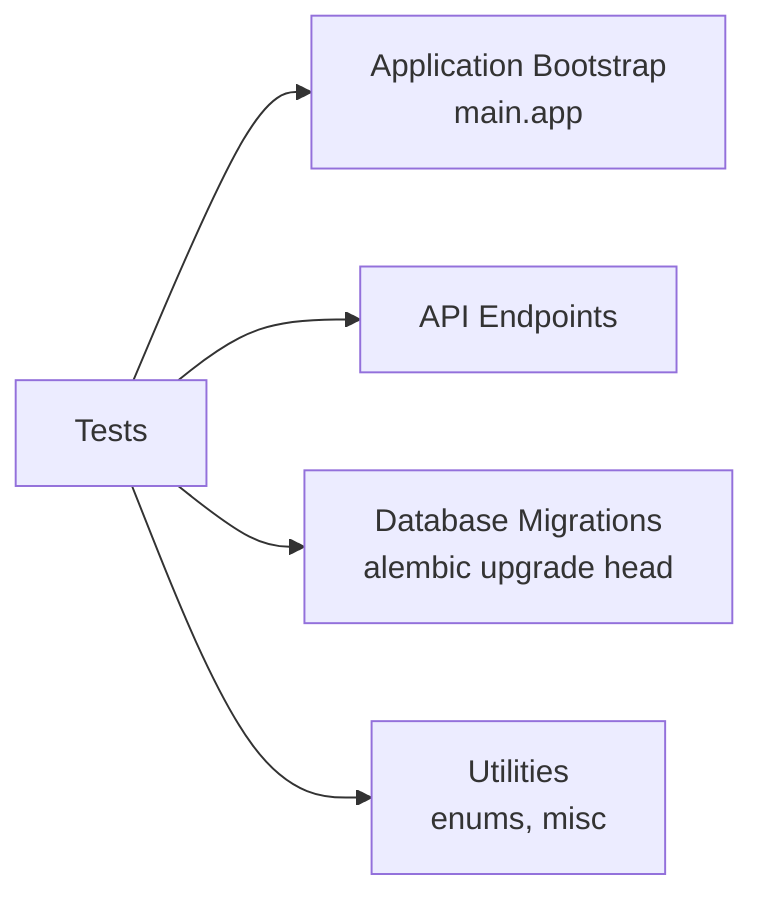

# Tests

## Module Overview

The `t2c_backend/tests` package is an **end-to-end integration test suite** that exercises the REST API through FastAPI's `TestClient` against a real, migrated database. Rather than unit-testing components in isolation, the suite boots the actual `main.app`, applies Alembic migrations, and drives the full request lifecycle (middleware → auth → services → repository → DB) for every `/api/v1` endpoint. Tests are **globally ordered** and **stateful**: they run as one long scripted scenario (register → authenticate → create organization → create asset types → create assets → services → audits → cleanup), sharing data between test files through container fixtures.

## Layout

```
t2c_backend/tests/
├── conftest.py                     # All shared fixtures (Faker factories, clients, containers)
├── utils/
│   └── misc.py                     # Pagination helper model
├── fakes/
│   └── clients/                    # Empty package — extension point, no fakes yet
└── app/
    └── endpoints/v1/rest/          # One test module per REST resource
        ├── test_health.py
        ├── test_register.py
        ├── test_authentication.py
        ├── test_product_pass_type.py
        ├── test_organization.py
        ├── test_location.py
        ├── test_user.py
        ├── test_asset_type_category.py
        ├── test_asset_type.py
        ├── test_asset.py
        ├── test_asset_pass.py
        ├── test_service.py
        ├── test_typeplate.py
        ├── test_audit.py
        └── test_instruction_manual.py
```

The test directory mirrors the production endpoint tree (`app/endpoints/v1/rest`), so each router has a co-located test module. There are 203 test functions across 15 REST modules — the largest are `test_asset_type.py` (41), `test_asset_type_category.py` (30), and `test_asset.py` (21).

## Architecture

The suite is built from three collaborating pieces: **fixtures** that produce clients and fake data, **container fixtures** that carry created entities forward, and **ordered test modules** that read and write those containers in sequence.



## How It Works

### Real app, real database

`conftest.py` imports the production application directly:

```python
from main import app
from fastapi.testclient import TestClient


@pytest.fixture(scope="session")
def database_migration() -> None:
    alembic_args = ["--raiseerr", "upgrade", "head"]
    alembic.config.main(argv=alembic_args)


@pytest.fixture(scope="session")
def client(database_migration) -> Generator:
    with TestClient(app) as c:
        yield c
```

Every client fixture depends on `database_migration`, so the schema (and any seeded static data) is created once per session before requests are made. Because `TestClient` runs the app's lifespan, startup clients (JWT, cryptography, storage) are wired up exactly as in production.

### Four client fixtures

| Fixture | Scope | Purpose |
| --- | --- | --- |
| `client` | session | Unauthenticated client — used for health checks, register/login flows, and negative auth tests (expecting `401`/`422`). |
| `authenticated_client` | session | Logs in with `user_data["credentials"]` and pre-sets the `Authorization: Bearer <token>` header for every request. |
| `second_user_client` | function | Borrows `authenticated_client`, swaps its header for a token obtained by logging in as `second_user_data`, and always restores the original header afterwards — including when the login fails. |
| `public_client` | function | Borrows `authenticated_client` and **removes** its header for the duration of one test, so public routes are exercised with no token at all. Restores it afterwards. |

`client` and `authenticated_client` are **session-scoped**, so the same client (and its auth header)
persists across all test modules.

`second_user_client` is **function-scoped** and wraps the session client rather than creating a new one:

```python
@pytest.fixture(scope="function")
def second_user_client(authenticated_client, second_user_data) -> Generator:
    """Return the session client authenticated as the second user."""
    authorization = authenticated_client.headers["Authorization"]
    try:
        response = authenticated_client.post(
            "/api/v1/login",
            json=second_user_data["credentials"],
        )
        assert response.status_code == 200
        token = response.json()["access_token"]
        authenticated_client.headers["Authorization"] = f"Bearer {token}"
        yield authenticated_client
    finally:
        authenticated_client.headers["Authorization"] = authorization
```

Three details make this safe inside the shared, ordered suite:

- The first user's header is **read, not removed**, before the login runs. Because `authenticated_client`
  is session-scoped, a fixture that popped the header first and only restored it after a successful
  `yield` would strand the shared client: a failed second-user login raises during setup, pytest never
  runs the teardown, and every later test keeps using a client that has lost the first user's token.
  Reading the value instead means the header is only ever overwritten once a token is in hand, so the
  failure path leaves the client untouched.
- The restore lives in a `finally`, so the swap is undone on every exit path — test failure, or the
  generator being closed during teardown — and the fixture stays correct if a fallible step is ever
  added after the header is swapped.
- `POST /api/v1/login` reads credentials from the request body and never inspects the `Authorization`
  header, so the header does not need to be removed for the login itself — it is swapped purely so that
  requests made *through the fixture* act as the second user.

Multi-tenant tests therefore just declare the fixture and post normally — no manual login call and no
per-request `headers={"Authorization": ...}` override:

```python
@pytest.mark.order(after="test_create_organization_with_location")
def test_create_organization_with_location_for_second_user(
    second_user_client: TestClient,
    ...
):
    response = second_user_client.post("/api/v1/organization", data={...})
```

It is used by the `*_for_second_user` tests in `test_organization.py`,
`test_asset_type_category.py`, `test_asset_type.py`, and `test_asset.py`.

`public_client` follows the same borrow-and-restore shape, but removes the header instead of swapping it:

```python
@pytest.fixture(scope="function")
def public_client(authenticated_client) -> Generator:
    """Return a client without an Authorization header, for routes that need no token."""
    authorization = authenticated_client.headers["Authorization"]
    try:
        del authenticated_client.headers["Authorization"]
        yield authenticated_client
    finally:
        authenticated_client.headers["Authorization"] = authorization
```

It exists because the obvious alternative — standing up a second `TestClient` — does not work here. Entering
a `TestClient` runs the app lifespan, which rebuilds `app.database_engine` on the entering client's event
loop, so only the client that entered **last** can still reach the database. Borrowing the session client
and dropping its header for one test sidesteps that entirely.

The ordering follows the same rule as `second_user_client`: the header is **read before the `try`**, where
nothing has been mutated yet, and the only mutation happens inside the `try` so the `finally` restore is
guaranteed to run. Registering the finalizer this way is what keeps a failure from stranding the shared
session client without its token.

Note the distinction from `client`, which is also unauthenticated: `client` is a separate session-scoped
client that never logged in, so it is the right fixture for `401` negative tests. `public_client` is the
*authenticated* session client with its token temporarily removed, which is what lets a test reach a public
route while the surrounding ordered scenario keeps its logged-in state. The public document tests in
`test_asset_pass.py` use it.

### Fake data with Faker

`conftest.py` centralizes payload generation with a session-scoped `Faker(locale="fr_FR")` instance. Data fixtures fall into two shapes:

- **`session`-scoped fixtures** (e.g. `user_data`, `asset`, `asset_type`, `audit`) — produced once and reused, so the same identity/entity is referenced consistently across the ordered scenario.
- **`function`-scoped fixtures** (e.g. `location`, `organization`, `asset_type_category`, `update_asset`) — regenerated per test, used where each test needs fresh input or a distinct update payload.

A `user_data_factory` builds nested credential/basics dicts, and `user_data` / `second_user_data` use it to model two independent users (the suite verifies multi-tenant isolation by creating parallel data for a second user). `second_user_data` is consumed directly by `test_register.py` and, for every authenticated call, through the `second_user_client` fixture described above.

### Container fixtures — the data pipeline

The distinguishing pattern of this suite is the **container fixture**: an empty session-scoped `dict` or `list` that tests mutate to pass created entities downstream.

```python
@pytest.fixture(scope="session")
def container():
    return {}

# In test_organization.py — write:
container["organization_id"] = response.json()["id"]

# Later in test_asset.py — read:
"location": container["location"],
```

Because these are session-scoped, a value written by an early test is visible to every later test. Containers include `container`, `product_pass_type_container`, `asset_type_container`, `asset_container`, `asset_type_category_mapping_container`, `typeplate_container`, `service_container`, `audit_container`, `organization_container`, `asset_pass_document_container`, and others. This is what lets, for example, `test_asset.py` create an asset that references an organization created back in `test_organization.py` and an asset type created in `test_asset_type.py`.

`asset_pass_document_container` is the widest-reaching of these, and shows how far a container can span. It is keyed by `DocumentFor` and accumulates one known-good document per source as the scenario walks through the modules that create them — the instruction manual and field document in `test_asset_type.py`, the EU file in `test_typeplate.py`, the task document in `test_audit.py` — recording each document's name and raw bytes at upload time. `test_asset.py::test_create_asset` then pins the new asset to that same asset type — selecting it by the recorded `asset_type_name` rather than at random, so the passport is guaranteed to carry the documents under test. `test_asset_pass.py` closes the loop: `test_list_asset_pass` captures the resulting `passId`, and the public document tests replay each entry against `GET /asset-pass/{passId}/document/{documentFor}/{documentId}`, asserting the streamed bytes match what was uploaded. That is why those upload tests carry small additions in this suite: they are feeding the passport assertions downstream.

This is also why `test_asset_pass.py` runs **last**, after `test_health.py::test_health`, rather than next to `test_asset.py`: its container is not fully populated until the audit module has created its task document, so the passport assertions have to follow every module that contributes a document.

### Global ordering with pytest-order

Because tests depend on entities created by earlier tests, execution order is fixed with the
**`pytest-order`** plugin. Ordering is expressed **relatively**, not as a global numeric sequence:
essentially every mark in the suite is `@pytest.mark.order(after=...)`, naming the test it must follow.
Within a module the target is a bare test name; across modules it is qualified with the file:

```python
# test_register.py — chains within the module
@pytest.mark.order(after="test_register")
def test_register_without_firstname_lastname(...): ...

# test_authentication.py — chains onto a test in another module
@pytest.mark.order(after="test_register.py::test_register_without_firstname_lastname")
def test_authentication(...): ...

# test_product_pass_type.py — continues the cross-file chain
@pytest.mark.order(after="test_authentication.py::test_authentication_without_password")
def test_product_pass_type(...): ...
```

This forms one long dependency chain — register → authenticate → product pass types → organization →
asset type category → asset type → asset → service/audit → health → asset pass — so the container
pipeline above always has its data ready. Relative marks are more robust than fixed numbers: inserting a
test in the middle does not require renumbering everything after it.

The chain is also what lets a module be split without disturbing the run: `test_asset_pass.py` was carved
out of `test_asset.py` to mirror the `asset_pass.py` router, and because its own marks are internal bare
names anchored to a single cross-file mark (`after="test_health.py::test_health"`), the eleven tests moved
as one block and kept their position at the tail of the suite.

Numeric marks (`@pytest.mark.order(3)`) are supported by the plugin but are **not** used here — the only
one in the tree is commented out at `test_asset_type.py:1124`. Tests with no mark at all (mostly negative
cases like "without password" or "unauthenticated client") are order-independent.

### Faking external clients

`t2c_backend/tests/fakes/clients/` exists as a package but is currently **empty** — `__init__.py` is a
zero-byte file and nothing in the suite imports from `tests.fakes`. `pytest-mock` is likewise declared as
a dependency but `mocker` is not used anywhere in the tests today. The scaffolding is in place for
swapping third-party integrations with deterministic fakes; the concrete integrations it was built for
live in proprietary modules outside this repository. Treat this as an extension point, not an active
mechanism.

### Helpers

`tests/utils/misc.py` provides a small `Pagination` Pydantic model (`page`, `pagesize`) used by the `create_pagination` fixture to exercise paginated list endpoints.

## Assertion Style

Tests assert on HTTP semantics rather than internal state:

- **Success:** `assert response.status_code == 200` (or `201` for creates).
- **Validation errors:** `assert response.status_code == 422` for malformed/missing-field payloads.
- **Auth:** `assert response.status_code == 401` when calling protected routes with the unauthenticated `client`.
- **Response shape:** subset checks like `assert {"refresh_token", "access_token"} <= response.json().keys()`.

## Configuration

Test discovery and paths are configured in `pyproject.toml`:

```toml
[tool.pytest.ini_options]
pythonpath = [".", "t2c_backend"]
testpaths = ["t2c_backend/tests"]

[dependency-groups]
test = [
    "faker>=40.37.0",
    "pillow>=12.3.0",
    "pytest>=9.1.1",
    "pytest-mock>=3.15.1",
    "pytest-order>=1.5.0",
]
```

The `pythonpath` entries let tests import production modules by their short package names (`from main import app`, `from utils.enums import ...`). `pillow` supports image-upload tests (e.g. `fake.image()` for organization logos).

## Running the Tests

```bash
# Install the test dependency group, then:
pytest                      # runs the full ordered suite against a migrated DB
pytest t2c_backend/tests/app/endpoints/v1/rest/test_health.py   # a single module
```

> **Note:** Because of the shared-container/global-order design, running an isolated subset of ordered tests may fail on missing prerequisite data — the suite is intended to run as a whole. A test database reachable by the app's `Config` must be available for the `alembic upgrade head` migration step.

## What the suite covers about authorization

The suite exercises the **happy path** of the permission system and the **unauthenticated** path, but
not the *insufficient-permission* path:

- `authenticated_client` registers a user and creates an organization, which seeds the `member`/`admin`/
  `owner` roles with the full permission bitmask. That user therefore satisfies every route's flag, so
  the `permissions={...}` requirements are covered only in the "granted" direction.
- Nearly every module has a `*_with_unauthenticated_client` counterpart asserting **401** for a request
  with no token.
- No test asserts **403 `Insufficient permissions.`** — there is no fixture for a user with a narrow
  role, so a typo'd or missing flag on a route would not fail the suite. Keep this in mind when adding
  guarded endpoints (see [Extending Tap2Cloud](extending.md)).
- `test_create_organization_role` posts an `organization_role` fixture whose `permissions` is a list of
  arbitrary Faker strings and asserts only `200` — consistent with `RoleService` discarding that list.

**Tenant isolation is covered separately from permissions.** Where the flag checks are only exercised in
the "granted" direction, the *location-based ownership* layer does get negative coverage, using the two
parallel users the fixtures build:

- `test_asset.py` asserts the boundary in both directions — `test_get_second_user_asset_by_id_with_first_authenticated_client`
  and `test_get_first_user_asset_by_id_with_second_user_client` each fetch an asset belonging to the other
  user by id and assert **404**, pinning the `location.organization_id` check in
  `AssetService.get_asset_by_organization_id`
  (see [Services](services.md)).
- `test_organization.py::test_update_organization_duplicate_name_for_second_user` renames the second
  user's organization to the first user's name and asserts **409**, covering the duplicate-name guard.
  Note this test logs in inline and passes an explicit `Authorization` header rather than using the
  `second_user_client` fixture, because it needs the first user's name read *before* the swap.

## Dependencies



The suite touches nearly every module transitively — booting `main.app` pulls in [Application Bootstrap](application-bootstrap.md), and each request flows through [API Endpoints](api-endpoints.md), [Services](services.md), [Core Infrastructure](core-infrastructure.md), and [Data Models](data-models.md). The migration fixture depends on [Database Migrations](database-migrations.md), and fixtures import enums/helpers from [Utilities](utilities.md).

## Cross-references

- [API Endpoints](api-endpoints.md) — the routers each test module targets
- [Application Bootstrap](application-bootstrap.md) — how `main.app` is assembled and its lifespan runs under `TestClient`
- [Database Migrations](database-migrations.md) — the `alembic upgrade head` invoked by the `database_migration` fixture
- [Security & Permissions](security-and-permissions.md) — the JWT flow behind `authenticated_client`
- [Permissions Reference](permissions-reference.md) — the flags the seeded roles grant
- [Overview](overview.md) — repository-wide architecture
