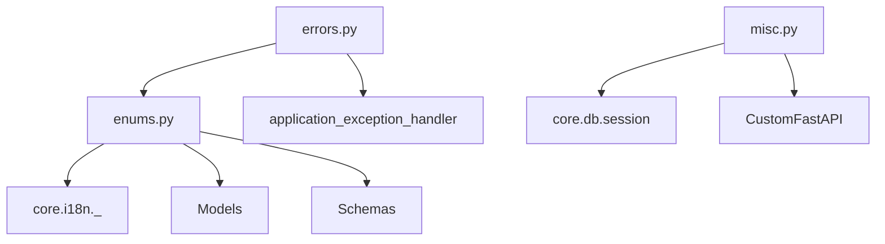
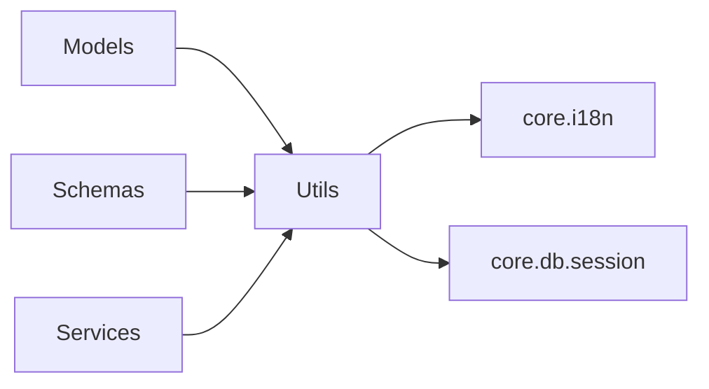

# Utilities

## Module Overview

The `utils` package holds cross-cutting helpers used everywhere in the codebase: the application's enumerations, the `ApplicationError` exception hierarchy that drives HTTP error responses, and a grab-bag of misc functions (async helpers, JWT-friendly datetime conversions, string casing, and the `DictContainer` that backs the app's service/client registries).

## Architecture Diagram



## Components

### Enums (`utils/enums.py`)

All enums are `StrEnum`/`IntEnum` and are used pervasively across models, schemas, and services:

- **`ENVIRONMENT`** — `test` / `development` / `staging` / `production`; governs debug mode, SQL echo, and log level.
- **`Role`** — `Member` / `Admin` / `Owner` / `Super Admin`, with helpers `organization_roles()` (excludes super admin), `from_value()`, and a name-based `__str__`.
- **`Permissions`-adjacent enums** — `InputType` (dynamic form field types), `AssetStatus` (14 lifecycle states), `DocumentStatus`, `DocumentType`, `DocumentFor` (storage sub-path selector), `ServiceTypes`, `TaskType`, `AuditTaskStatus` (translated via `_()`), `Status`, `UserStatus`, `SortBy`, `Language` (`en`/`de`), `TokenType` (email-verification vs forgot-password), and `ErrorMessageCodes`.

### Errors (`utils/errors.py`)

`ApplicationError(Exception)` carries `msg`, `error_code` (an `ErrorMessageCodes`), and `status_code`. It is caught by `application_exception_handler` ([Application Bootstrap](application-bootstrap.md)) and serialized to `{"msg", "errorCode"}`. Concrete subclasses map to HTTP status codes:

| Error | Status | Code |
| --- | --- | --- |
| `BadRequestError` | 400 | `BAD_REQUEST` |
| `UnAuthorizedError` | 401 | `NOT_AUTHORIZED` |
| `UnAuthenticatedError` | 403 | `NOT_AUTHENTICATED` |
| `NotFoundError` | 404 | `NOT_FOUND` |
| `AlreadyExistsError` | 409 | `ALREADY_EXIST` |
| `InvitationTokenExpiredError` | 498 | `TOKEN_EXPIRED` |
| `TokenError` / `TokenBackendError` | 500 | `SERVER_ERROR` |

### Misc (`utils/misc.py`)

- **`DictContainer(dict)`** — the backbone of the app's registries. Provides attribute-style access and an optional `session_based` mode: when session-based, packages are stored keyed by session id and `__getattr__` resolves the current request's session via `get_session_context()`. This is how `app.services.user_service` returns the instance bound to the active request. `add_package`, `remove_session` manage lifecycle.
- **Async helpers** — `maybe_coroutine(func, ...)` awaits a result only if it's awaitable; used by the extension loader.
- **Datetime/JWT helpers** — `aware_utcnow()`, `datetime_to_epoch()`, `datetime_from_epoch()` (used by the token classes), plus `datetime` utilities.
- **String helpers** — `underscore("DeviceType") → "device_type"` (used to derive service registry keys), `get_full_name()`, `get_name_from_email()`.
- **Reflection/config** — `r_getattr()` (dotted attribute access), `get_project_meta()` (parses `pyproject.toml`), `json_or_text()`, `_is_submodule()`.

## Dependencies



## Key APIs

```python
raise NotFoundError("User not found")   # → HTTP 404 {"msg": ..., "errorCode": "NOT_FOUND"}

underscore("AssetTypeService")          # "asset_type_service"  → service registry key
Role.organization_roles()               # roles excluding Super Admin
```

## Cross-references

- [Application Bootstrap](application-bootstrap.md) — `DictContainer` registries, error handler, `Config`
- [Core Infrastructure](core-infrastructure.md) — session context that `DictContainer` uses
- [Security & Permissions](security-and-permissions.md) — the `Role` enum and token datetime helpers
